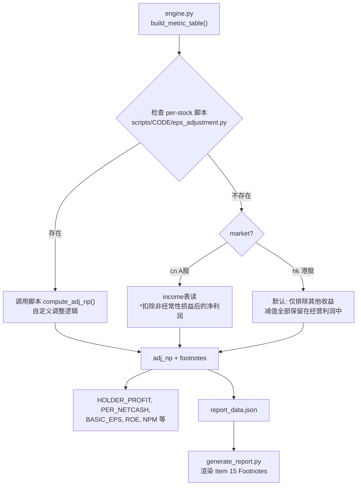

## 产品概述

修复当前 EPS 计算中"减值及拨备一刀切排除"的问题，采用 **engine 默认 + per-stock 脚本覆盖** 的架构（和现有 `business_commentary.py` 模式一致），并在 HTML 报告中增加 Item 15 Footnotes 说明 EPS 调整明细。

## 核心功能

### P1 - engine 默认 EPS 计算逻辑

- engine.py 内置默认的 `_compute_adj_np()` 函数，处理 80% 的通用情况
- **A股**：直接读取 income 表 `*扣除非经常性损益后的净利润`（审计后 CAS 扣非），不再自行计算
- **港股**：读取 `其他收益`+`减值及拨备`。保守策略：仅排除其他收益，保留全部减值在经营利润中（因为港股 API 无法拆分信用减值/资产减值/商誉减值）

### P2 - per-stock 脚本覆盖

- 和现有 `scripts/<code>/business_commentary.py` 模式一致
- 每个股票可选创建 `scripts/<code>/eps_adjustment.py`，提供 `compute_adj_np(reader, rd, np_val, tax_rate, stock_cfg)` 函数
- engine.py 优先查找 per-stock 脚本，未找到则使用默认逻辑
- 特殊企业示例：
  - `02328` 中国财险（Insurance）：减值即核心成本，仅排除其他收益 → 不需要额外脚本（默认逻辑已覆盖）
  - `00883` 中海油（Energy）：大额资产减值可能非经常 → 可写脚本做阈值判断
  - `300750` 宁德时代（A股科技）：A股自动用扣非净利润 → 不需要额外脚本

### P3 - HTML Item 15 Footnotes

- 在 AI Commentary 之后、版权行之前插入 Footnotes 区域
- 引擎计算时生成 footnotes 数据，描述 EPS 计算口径和排除项目
- 脚本覆盖模式：per-stock 脚本可返回自定义 footnotes 文本

## 技术栈

- Python 3.x
- SQLite（无需变更 schema）
- JSON（report_data.json）
- HTML + JavaScript（ECharts）

## 实现方案

### 整体架构



### 核心改动

#### 1. engine.py — 新增默认 `_compute_adj_np()` 函数

```python
def _compute_adj_np(reader, rd, np_val, tax_rate, stock_cfg):
    """计算 VL 口径扣非净利润。返回 (adj_np, footnotes_list)"""
    market = stock_cfg.get("market", "hk")
    footnotes = []
    
    if market == "cn":
        # A股: 直接使用审计扣非净利润
        deducted = reader.financial_item("income", "*扣除非经常性损益后的净利润", rd)
        if deducted is not None:
            footnotes.append(f"VL口径EPS基于审计扣非净利润 {deducted/1e8:.1f}亿（CAS标准）")
            return deducted, footnotes
    
    # 港股 / A股回退: 默认仅排除其他收益
    other_gain = reader.financial_item("income", "其他收益", rd) or 0
    impair = reader.financial_item("income", "减值及拨备", rd) or 0
    
    # 默认: 减值保留在经营利润中，仅排除其他收益
    nonrecur_adj = other_gain * (1 - tax_rate)
    adj_np = np_val - nonrecur_adj if np_val else None
    
    if other_gain != 0:
        footnotes.append(f"排除非经常性其他收益: {other_gain/1e8:+.1f}亿（税后 {nonrecur_adj/1e8:+.1f}亿）")
    footnotes.append(f"减值及拨备({impair/1e8:.1f}亿)视为经常性经营成本，保留在EPS中")
    
    return adj_np, footnotes
```

#### 2. per-stock 脚本接口 `scripts/<code>/eps_adjustment.py`

```python
def compute_adj_np(reader, rd, np_val, tax_rate, stock_cfg):
    """返回 (adj_np, footnotes_list)
    
    reader: DB reader 对象
    rd: report_date 字符串
    np_val: 原始归母净利润
    tax_rate: 税率 (0-1)
    stock_cfg: config.STOCKS[code] 完整配置
    """
    # 自定义计算...
    return adj_np, footnotes
```

#### 3. engine.py build_metric_table() 集成

替换原有第332-337行，改为：

```python
adj_np, yr_footnotes = _resolve_adj_np(reader, rd, np_val, tax_rate, stock_cfg)
if yr_footnotes:
    all_footnotes.append({"year": yr, "notes": yr_footnotes})
```

`_resolve_adj_np()` 先尝试 `import scripts.{code}.eps_adjustment`，失败则调用默认 `_compute_adj_np()`。

#### 4. generate_report.py — Item 15 Footnotes

在 AI Commentary 后插入：

```javascript
var footnotes = d.footnotes || [];
if (footnotes.length > 0) {
    html += '<div style="border-top:1px solid #000;padding:6px 12px;font-size:9px;line-height:1.4;color:#444">';
    html += '<span style="font-weight:700;font-size:10px">15. Footnotes (Earnings Adjustments)</span>';
    html += '<div style="margin-top:3px">';
    footnotes.forEach(function(f) {
        html += '<div style="margin:1px 0">· ' + f + '</div>';
    });
    html += '</div></div>';
}
```

### 与现有 business_commentary.py 模式对比

| 特性 | business_commentary.py | eps_adjustment.py |
|------|----------------------|-------------------|
| 函数签名 | `build(stock, metrics, rev_struct, years, cagr, spot)` | `compute_adj_np(reader, rd, np_val, tax_rate, stock_cfg)` |
| 调用位置 | `build_report()` 中 business/commentary 段 | `build_metric_table()` 中 EPS 调整段 |
| 返回值 | `{"business": str, "commentary": [str]}` | `(adj_np, footnotes_list)` |
| 覆盖行为 | engine 先 import，失败则用 config fallback | 同上 |
| 是否必须 | 否（无脚本时用 engine 默认逻辑 / config fallback） | 否（无脚本时用 engine 默认计算） |

## 实现注意事项

- `adj_np` 变量名保持不变，下游 8 处引用无需修改
- 现有 `scripts/` 目录下所有 `<code>/` 子目录已存在，新增文件即可
- footnotes 数据通过 `build_report()` 传入 report_data.json
- 清理临时探查脚本 `_inspect_impairment.py`