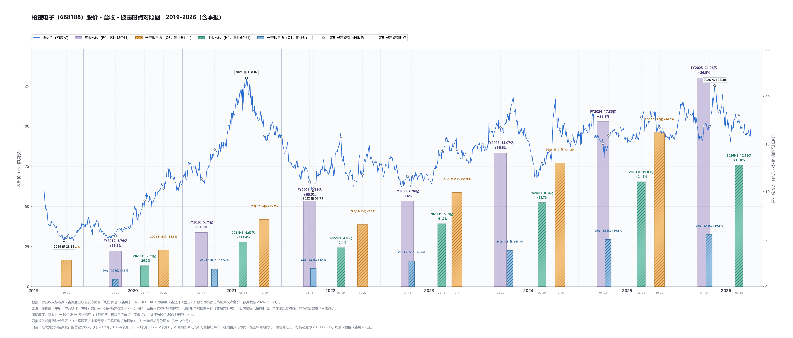

# 柏楚电子（688188.SH）· 营收 × 披露时点 × 股价 对照图（2019-2026）

> 一张图看「营收什么时候被市场知道」与「当时股价在什么位置」的时间关系。

## 读法

- 单面板叠加：左轴＝前复权收盘价（元），右轴＝营业总收入（亿元），两者共用同一时间轴。
- 每根营收柱的**横向位置＝该期报告的实际披露日**（NOTICE_DATE），不是报告期末。
- 柱宽随涵盖月份递增（Q1 22 天 → FY 46 天）；四色＝一季报蓝 / 中报青绿 / 三季报橙 / 年报紫。
- 柱高为**按报告期累计**营收，不同口径（3 / 6 / 9 / 12 个月）之间不可直接比高低；柱顶百分比为同口径上年同期同比。
- 股价线与所有标注压在柱之上（同一 axes 内 zorder 分层：柱 → 线 → 标注）。
- 2019-08-08 上市，此前披露的报告期未入图。

## 关键读数（单位：亿元 / 元）

| 报告期 | 累计营收 | 同比 | 披露日 | 披露日收盘（前复权） |
|---|---|---|---|---|
| FY2019 | 3.76 | +53.3% | 2020-04-28 | 31.61 |
| FY2020 | 5.71 | +51.8% | 2021-03-11 | 67.36 |
| FY2021 | 9.13 | +60.0% | 2022-04-15 | 65.26 |
| FY2022 | 8.98 | −1.6% | 2023-04-11 | 68.85 |
| FY2023 | 14.07 | +56.6% | 2024-03-20 | 99.23 |
| FY2024 | 17.35 | +23.3% | 2025-04-03 | 89.20 |
| FY2025 | 21.96 | +26.5% | 2026-04-10 | 100.13 |
| 2026H1 | 12.78 | +15.8% | 2026-08-18 | 107.15 |

要点（均以表中数据为据）：

- **7 个完整年度里只有 FY2022 一次负增长（−1.6%）**，其余年度同比 +23.3% ~ +60.0%。
- **增速在 FY2023 见顶后逐级下台阶**：+56.6%（FY2023）→ +23.3%（FY2024）→ +26.5%（FY2025）→ +15.8%（2026H1）。
- **业绩最好的年份，股价高点先到**：2021 年内收盘高点 130.07 元（前复权，2021-08-25）出现在 FY2021（+60.0%）披露之前；该年报 2022-04-15 披露时收盘 65.26 元，较高点腰斩。
- **披露日股价多数落在 65~107 元区间**：FY2025（+26.5%）2026-04-10 披露当日 100.13 元，2026H1（+15.8%）2026-08-18 披露当日 107.15 元；2026 年内收盘高 125.30（05-20）、低 90.30（07-17）。
- **披露节奏**：年报从 03-11（FY2020）/04-28（FY2019）逐年提前到 4 月上旬（FY2023 03-20、FY2024 04-03、FY2025 04-10）；中报集中在 8 月中下旬；三季报 10 月下旬；一季报多与上年报同日披露。

> **数据源**：东方财富「利润表-按报告期」营业总收入 + NOTICE_DATE（定期报告公开披露日）· 新浪日线前复权（`ak.stock_zh_a_daily`，qfq）。行情起点 2019-08-08，本图数据截至 2026-09-30；柱位置＝该期报告的实际披露日，共 28 期。

## 参见

- [[AI软件/柏楚电子/2444变化论扫描]] — 同标的变化论扫描（智能焊接/整线第二曲线、毛利率 −4.90pct）
- [[AI软件/柏楚电子/跟踪]] — 同标的跟踪页
- [[白马/山东赫达/营收-披露时点-股价对照图]] — 同款图的另一个标的（2016-2026，40 期）
- [[消费/泡泡玛特/营收-披露时点-股价对照图]] — 同款图港股版（2020-2026，12 期，港交所刊发时刻）
