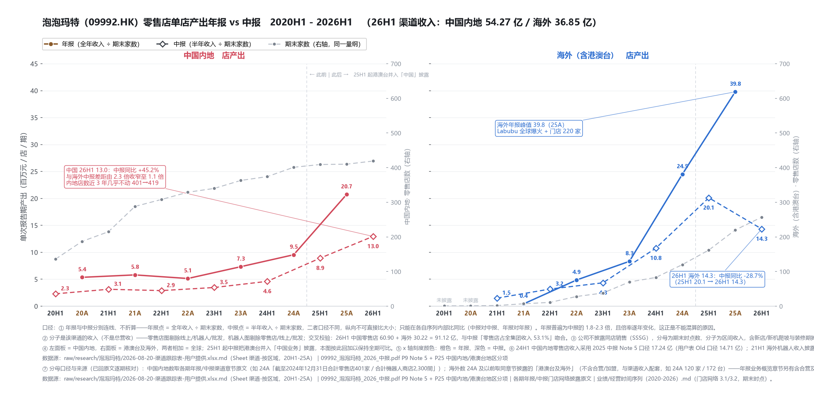
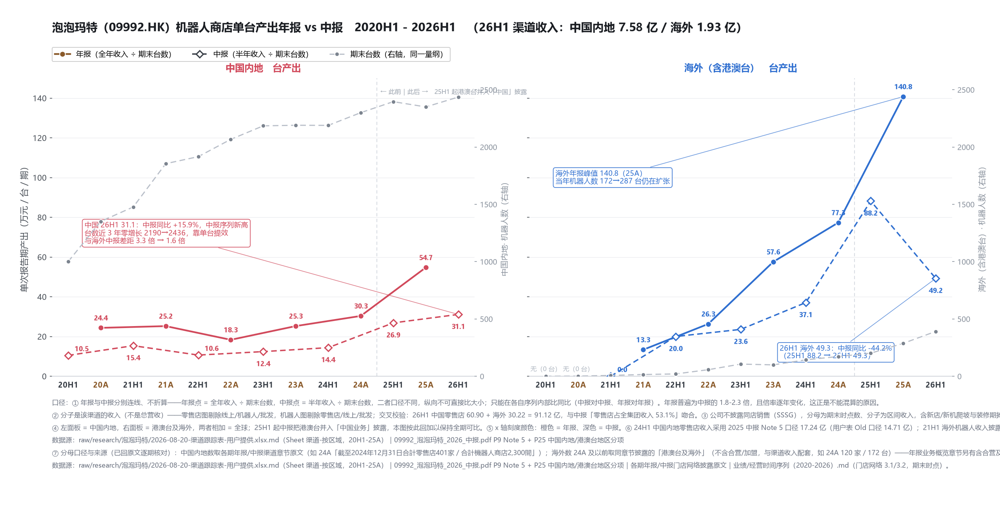

# 泡泡玛特（09992.HK）· 渠道单店 / 单台产出时间线

> **一句话**：把「渠道收入 ÷ 期末单位数」拆成**中国内地 / 海外**两个面板、**年报线 / 中报线**两条线，看**每一家店、每一台机器在单个报告期里产出多少钱**——区分"增长来自开更多店"还是"来自单产提升"。
>
> **⚠️ 一句话口径警告：年报线与中报线口径不同（全年 vs 半年），纵向不可比大小，只能在各自序列内部比同比。**

---

## 一、零售店：单店产出

## 二、机器人商店：单台产出

**图的结构**：左面板 = **中国内地**，右面板 = **海外（含港澳台）**，两面板共享纵轴刻度；每个面板自带**右轴**画该区域的门店/机器人数（用来解释"摊薄"）。**实线圆点 = 年报线**（全年收入 ÷ 期末单位数），**虚线菱形 = 中报线**（半年收入 ÷ 期末单位数）。

---

## 三、关键读数

### 零售店（百万元 / 店 / 期）

| 期 | 中国内地 | 海外 | 海外 ÷ 中国内地 |
|---|---|---|---|
| 25A（年报） | 20.7 | **39.8**（序列峰值） | 1.9× |
| 25H1（中报） | 8.9 | 20.1 | **2.3×** |
| **26H1（中报）** | **13.0** | **14.3** | **1.1×** |
| 26H1 同比 | **+45.2%** | **−28.7%** | 倍数差消失 |

### 机器人商店（万元 / 台 / 期）

| 期 | 中国内地 | 海外 | 海外 ÷ 中国内地 |
|---|---|---|---|
| 25A（年报） | 54.7 | **140.8**（序列峰值） | 2.6× |
| 25H1（中报） | 26.9 | 88.2 | **3.3×** |
| **26H1（中报）** | **31.1**（中报序列新高） | **49.3** | **1.6×** |
| 26H1 同比 | **+15.9%** | **−44.2%** | — |

### 分母（单位数）在同期怎么动

| 期 | 中国内地零售店 | 海外零售店 | 中国内地机器人 | 海外机器人 |
|---|---|---|---|---|
| 23H1 | 340 | 38 | 2,185 | 106 |
| 24A | 401 | 120 | 2,300 | 172 |
| 25A | 410 | 220 | 2,350 | 287 |
| **26H1** | **419** | **257** | **2,436** | **391** |

**→ 中国内地店数近三年几乎不动（401 → 419），台数近三年零增长（2,190 → 2,436）；而海外仍在快速铺（店 120 → 257，台 172 → 391）。**

---

## 四、这两张图能读出什么、不能读出什么

**能读出的（事实层）**

1. **海外单产在 25A 见顶**（零售店 39.8、机器人 140.8 均为序列峰值），**26H1 双双大幅回落**（−28.7% / −44.2%）；
2. **中国内地单产在提升**：零售店 26H1 **+45.2%**，机器人 26H1 **+15.9% 且为中报序列新高**——**在国内店数/台数几乎不增的前提下，增长全部来自单产**；
3. **海外与中国的单产差距在快速收窄**（零售店 2.3× → 1.1×；机器人 3.3× → 1.6×）——曾经"海外一家店顶国内两三家"的溢价基本消失。

**不能读出的（⚠️ 口径限制）**

> 脚本原文口径：**「公司不披露同店销售（SSSG），分母为期末时点数、分子为区间收入，含新店/新机爬坡与装修期摊薄，是上界方向读数而非纯需求读数。」**

**即：26H1 海外单产下滑，无法据此直接判定是"需求转弱"还是"新店爬坡摊薄"**——海外 26H1 净增门店 37 家、净增机器人 104 台，分母扩张本身就足以压低均值。**要分清二者必须要有 SSSG，而公司不披露。**

**这也是这两张图的定位**：**提供方向，不提供定性**。

---

## 五、完整口径声明（照录脚本，逐条）

1. **年报线与中报线分开连线、不折算**——年报点 = 全年收入 ÷ 期末单位数，中报点 = 半年收入 ÷ 期末单位数。**二者口径不同，纵向不可直接比大小**，只能在各自序列内部比同比。年报普遍为中报的 **1.8–2.3 倍**，且倍率逐年变化——这正是不能混算的原因。
2. **分子是该渠道的收入，不是总营收**——零售店图剔除线上/机器人/批发，机器人图剔除零售店/线上/批发。交叉校验：26H1 中国零售店 60.90 + 海外 30.22 = **91.12 亿**，与中报「零售店占全集团收入 **53.1%**」吻合。
3. **左面板 = 中国内地，右面板 = 港澳台及海外**，两者相加 = 全球；**25H1 起中报把港澳台并入「中国业务」披露，本图已回加**以保持全期可比（图上有一条 25H1 的竖线标记口径切换）。
4. **x 轴刻度颜色**：橙色 = 年报，深色 = 中报。
5. **两处特殊口径**：24H1 中国内地零售店收入采用 2025 中报 Note 5 口径 **17.24 亿**（用户渠道表 Old 口径为 14.71 亿）；21H1 海外机器人收入披露为 **0**（当年仅 7 台）。
6. **分母来源**：中国内地数取各期年报/中报渠道章节原文（如 24A「合計零售店 401 家／合計機器人商店 2,300 間」）；海外数 **24A 及以前**取同章节「港澳台及海外」（**不含合营/加盟**，与渠道收入配套，如 24A 120 家／172 台）——年报业务概览章节另有含合营及加盟口径（24A 130 家／192 台），**不采用**（合营/加盟收入不计入渠道收入）；**25H1/26H1** 中报渠道章节不再披露海外分项，改用「**全球 − 中国内地**」倒推（全球取中报概览 571／2,597、676／2,827），这两期与前期可能存在含合营口径的小幅差异。
7. **左面板 y 轴 = 单次报告期产出**；右轴 = 期末单位数（淡灰虚线），两个面板各自独立。

---

## 六、诚实标注

- 本页为**图的说明页**，数据与口径均来自出图脚本；本页作者未独立回核原始年报/中报。
- **26H1 的海外单位数（257 家 / 391 台）为「全球 − 中国内地」倒推值**，与 24A 及以前的"不含合营/加盟"口径可能存在小幅差异（脚本已注明）。
- 本页**不对"海外单产下滑"作定性解释**——摊薄与需求转弱在本口径下不可分。

> **数据源**：泡泡玛特渠道跟踪表（20H1–25A 渠道收入，按区域）· 2026 中报 Note 5 与 P25（中国内地 / 港澳台地区 数量与收入）· 各期年报与中报门店网络披露。左面板＝中国内地，右面板＝港澳台及海外，两者相加＝全球。

## 参见

- [[营收-披露时点-股价对照图]] — 同期「业绩披露时点 × 股价位置」对照（同目录，同体例）
- [[业绩/经营时间序列（2020-2026）]] — 门店网络与收入全序列（本页分母来源）
- [[运营指标]] — 会员 / 复购 / 存货周转等运营读数
- [[跟踪/横切变量跟踪]] — 六个横切变量（库存 / 经营杠杆 / 人 / 租金 / 物流 / 营运资本）
- [[跟踪/04-海内外收入分化（2026H1）机制与判据]] — 海内外分化的机理分析
- [[research/index.md]] · [[research/log.md]]
