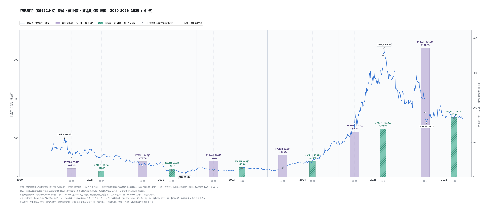

# 泡泡玛特（09992.HK）· 营收 × 披露时点 × 股价 对照图（2020-2026）

> 一张图看「业绩什么时候被市场知道」与「当时股价在什么位置」的时间关系。港股版：柱位置来自港交所披露易的**业绩公告实际刊发时刻**（精确到分钟），比 A 股 NOTICE_DATE 更细。



## 读法

- 单面板叠加：左轴＝前复权收盘价（**港元**），右轴＝营业额（**亿元人民币**），共用同一时间轴。两者币种不同，只作走势与位置对照，不可相除。
- 每根柱的**横向位置＝该期业绩公告在港交所的刊发日**（非报告期末）。
- 港股无强制季报，只有两色：**年报紫（累计 12 个月）/ 中报青绿（累计 6 个月）**，柱宽随涵盖月份递增；柱高为累计口径，FY 与 H1 之间不可直接比高低；柱顶百分比为同口径上年同期同比。
- 港股业绩公告分「午间休市刊发」（12:00-12:26，当日午后即反应）与「收市后刊发」（16:30-18:00，反应在次日）。图上灰色空心点统一取**公告后首个交易日**收盘价。
- 2020-12-11 上市，此前披露的报告期未入图，共 12 期（FY/H1 各 6 期）。

## 关键读数（营业额：亿元人民币；股价：港元，前复权）

| 报告期 | 累计营业额 | 同比 | 公告日（刊发时刻） | 公告后首个交易日收盘 |
|---|---|---|---|---|
| FY2020 | 25.13 | +49.3% | 2021-03-26 12:26 | 52.20（当日） |
| 2021H1 | 17.73 | +116.8% | 2021-08-27 12:22 | 50.02（当日） |
| FY2021 | 44.91 | +78.7% | 2022-03-28 12:24 | 29.74（当日） |
| 2022H1 | 23.59 | +33.1% | 2022-08-25 12:07 | 18.62（当日） |
| FY2022 | 46.17 | +2.8% | 2023-03-29 12:10 | 18.75（当日） |
| 2023H1 | 28.14 | +19.3% | 2023-08-22 18:00 | 22.89（次日 08-23） |
| FY2023 | 63.01 | +36.5% | 2024-03-20 12:09 | 23.96（当日） |
| 2024H1 | 45.58 | +62.0% | 2024-08-20 17:00 | 45.26（次日 08-21） |
| FY2024 | 130.38 | +106.9% | 2025-03-26 12:00 | 137.68（当日） |
| 2025H1 | 138.76 | +204.4% | 2025-08-19 17:00 | 310.50（次日 08-20） |
| FY2025 | 371.20 | +184.7% | 2026-03-25 12:22 | 165.37（当日） |
| 2026H1 | 171.73 | +23.8% | 2026-08-20 16:30 | 149.00（次日 08-21） |

要点（均以表中数据为据）：

- **增速一条大拱形**：+49.3% → +116.8% → +78.7% → +33.1% → +2.8%（FY2022 谷）→ +19.3% → +36.5% → +62.0% → +106.9% → +204.4%（2025H1 峰）→ +184.7% → **+23.8%（2026H1 骤落）**。2026 年管理层在 25A 业绩会自认"全年大概率完不成 +20%"，2026H1 是该指引下的第一份答卷。
- **披露节奏极规律**：年报固定 **3 月 20-29 日**，中报固定 **8 月 19-27 日**；刊发时刻 2023H1 起从午间（12:00 前后）整体切换为收市后（16:30-18:00）。
- **2025-08-19 是全案的爆点**：25H1（+204.4%）收市后公告，次日 310.50 渠口跳升，一周后 2025-08-26 见历史最高 **329.56**（收盘口径，盘中 333.88）——历史高点出现在业绩公告后第 5 个交易日。
- **业绩最好的一年，公告日股价已腰斩**：FY2025 营业额 371.20 亿（+184.7%，历史最高）2026-03-25 午间公告，当日收 165.37，较 2025-08-26 高点 **−49.8%**。与山东赫达（FY2024 新高披露当日处十年低位）、柏楚电子（FY2021 披露时较高点腰斩）同构：**市场定价的是增速的方向，不是营收的绝对值**。
- **增长还在、股价先崩的一段**：2021 高 100.47 → 2022-10-31 低 9.80（**−90.2%**），期间 FY2021（+78.7%）公告当日 29.74、2022H1（+33.1%）公告当日 18.62——营收正增长持续了整个下跌段，属纯杀估值。
- 2026 年内：低 139.33、最新收 149.90（2026-10-05），较历史高点 −54.7%。

## 复现

```bash
PYTHONUTF8=1 .venv/Scripts/python.exe scripts/09992/revenue_price_timeline_hk.py \
  --code 09992 --name 泡泡玛特 --extremes 2021:high,2022:low,2025:high,2026:low \
  --out "research-wiki/research/消费/泡泡玛特/assets/revenue-price-timeline.png" \
  --csv scripts/out/09992_revenue_vs_price.csv
```

脚本：`scripts/09992/revenue_price_timeline_hk.py`（港股版，与 skill `revenue-price-timeline` 的 A 股版同版式；差异＝数据源三件套换港股：东财港股利润表 + 港交所披露易 + 港股日线前复权，期别收敛为 FY/H1 两色，标注点口径为「公告后首个交易日」）。明细 CSV：`scripts/out/09992_revenue_vs_price.csv`（12 期）。

## 参见

- [[消费/泡泡玛特/业绩/业绩会纪要索引（2020-2026）]] — 12 场业绩发布会全序列（本图 12 期业绩的发布会口径对照）
- [[消费/泡泡玛特/投资论点]] — 同标的投资论点页
- [[白马/山东赫达/营收-披露时点-股价对照图]] — 同款图 A 股版之一（2016-2026，40 期）
- [[AI软件/柏楚电子/营收-披露时点-股价对照图]] — 同款图 A 股版之二（2019-2026，28 期）
