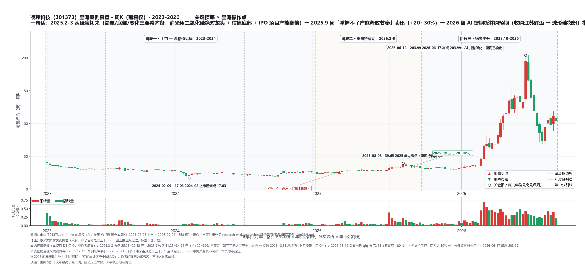

# 里海案例 · 凌玮科技（301373）

> **一句话定位**：**"完整做对买点、干净卖出、然后错过一倍"的守正出奇标本**——2025.2-3 从硅宝切来（简单/底部/变化三要素齐备，见 2026.3.12 专文完整自述），2025 年内"赚了百分之二三十"后因"**无法掌握新产能释放节奏**"卖出；卖出后股价 30 元 → 80 多元翻倍多，触发原因是**现金收购江苏辉迈 70% 股权切入球形硅微粉（M9 级覆铜板关键原材料 → AI 概念）**，而这是作者买入时**不可预知的外生催化剂**。作者自评：靠体系赚钱而非抓牛股——"把正守好了，会经常出奇；只为出奇而忽略守正，就大概率成为被割的韭菜"。
>
> 本页为 [[里海体系-总览]] 的案例证据层（**术·简单/底部/变化完整正例 + 道·概率（拿不准就退）+ 守正出奇**）。账户口径=30 万示范账户（2025 上半年持有，年内卖出）；**业绩为作者自述口径**，未独立核实；引语逐字摘录。
>
> ⚠️ 与 [[里海案例-博隆技术]] 是同一笔切换的两条腿（同买同卖），但**只有凌玮有事后专文复盘**。

---

## 一、体系 × 证据 映射（核心表）

### 1. 术——**简单** · **底部** · **变化** · 分仓

- **术·简单（作者原话，2026.3.12）**："简单、底部、变化。**公司专业专注，是国内消光用二氧化硅领域的绝对龙头**，其核心产品广泛应用于涂料、皮革、油墨、光伏等多个工业领域，终端客户覆盖轨道交通、3C 电子、光伏等 20 多个行业。公司作为**国内消光粉行业标准牵头起草单位**，生产基地湖南三 A 新材料是国内三大无机硅生产基地之一，**技术壁垒与市场占有率双高**。公司的财务结构也非常简单，没有什么漏洞，而且**产品的价格和毛利率非常的稳定**。2025 年 1-9 月，公司实现营业收入 3.68 亿元，归母净利润 1.03 亿元，业绩表现非常稳健。"
- **术·底部（原话）**："同时，公司的**估值也不高，处于底部附近，具备一定的安全边际，尚未被市场发现其价值**。"
- **术·变化（原话）**："而与此同时，公司也**酝酿着变化**，即 **IPO 项目年产 2 万吨超细二氧化硅气凝胶及研发中心建设项目即将投产，会在原有的基础上产能翻倍**。"——"变化=可能，而非等变化发生"的教科书级表述。
- **术·分仓**：仓位未披露；但资金来自[[里海案例-硅宝科技]]清仓款的一部分（与博隆分食）。

> 这是全案例库中**"简单 / 底部 / 变化"三要素被作者自己逐条写全的少数样本之一**（可与 [[里海案例-秦安股份]]、[[里海案例-川环科技]] 并读）。价值在于：**三要素全对，仍可能赚不到大钱**。

### 2. 道——常识 · 概率 · 赔率 · 频率

- **道·常识**：行业标准牵头起草单位 + 国内三大无机硅基地之一 + 价格与毛利率长期稳定 = 用小行业地位常识替代深研。
- **道·概率（卖出理由，原话）**："但我当时为什么会卖呢？原因就是**经过一段时间的跟踪之后，发现我无法掌握其新产能的释放节奏，我心里就没底了**。"——概率判断失效（产能能否卖出=不可知）→ **退出，而不是赌**。
- **道·赔率（向下的量化，原话）**："**如果新产能销售不畅的话，那么固定资产的折旧就会吞噬利润**，于是我就卖出了。"——这正是他对"扩产型公司"的标准担忧（同一逻辑也用在 2025.9.24 涪陵榨菜定增智能工厂："工厂建好后产品能不能有效销售？不能反而利空"）。
- **道·频率**：2025 上半年买入 → 年内卖出（持约半年至数月），典型的战术级频率；作者 2026.3.12 自述"去年我赚了百分之二三十"。

### 3. 能力——价值判断 · 市场先生 · 心性 · 宏观

- **能力·价值判断（对）**：基本面判断被后续数据验证——2025 全年营收 5.00 亿元（+4.5%）、归母净利 1.37 亿元、毛利率约 45%（本地数据层口径，见文末附注），"价格和毛利率非常稳定"的表述成立。**问题不在公司判断，而在"催化剂不可预知"**。
- **能力·理解市场先生（事后识别，原话）**："那么凌玮这波到底是为什么被资金炒作呢？**从图形看，很明显是短期资金进来炒作了**。"——被炒原因："2025 年，公司进一步加速布局高端电子材料赛道，通过**现金收购江苏辉迈粉体科技有限公司 70% 股权，切入化学合成法球形硅微粉领域**。球形硅微粉是 **M9 级别覆铜板的关键原材料**，广泛应用于 5G 通信、人工智能等高端电子领域，市场空间巨大。尽管江苏辉迈的产品尚处于**下游客户小试阶段**，但市场对其技术突破与产能释放的**预期**，成为**股价爆发的直接催化剂**。"
- **能力·自我心性（原话）**："我卖出后，公司股价还继续跌了一段时间，**我心里还一喜，哎呀呀。于是我就错过了。**"——坦承"卖对了一半（躲过下跌）却错过整段"的心理落差；结论仍是"错失牛股不影响我持续地赚钱"。
- **能力·宏观**：无直接论述（此案例的驱动力是**产业催化（AI 覆铜板）**，而非宏观）。

### 4. 弱者思维

- **符合（原话）**："**因为我是靠体系赚钱，而非抓住哪一只牛股**，我觉得像凌玮科技这样被爆炒的股，**能拿住有点偶然性**。"——把"爆炒"归入运气项，不纳入体系能力。
- **对照案例（作者自举）**："举个例子，我 2024 年拿的个股**阳谷华泰**也是被爆炒，运气好的是被爆炒的时候我正好有持仓，而且我在顶部跑掉了。但**为何被爆炒，当时我是完全不知**，后来我才知道是咋回事。"——**同一体系、两次爆炒、一成一败，差别在运气**。参见 [[里海案例-阳谷华泰]]（暂缺页，见 2025.1.17 时间线条目）。

### 5. 战略 vs 战术股 / 方法论标签

- **战术股（明确）**：买入依据=底部+产能翻倍这类**可验证的战术级变化**（非几倍空间的战略级重构），因此"确定性能否掌握"就是持有与否的唯一开关。
- **方法论标签=守正出奇（2026 体系第 16 条）**，作者结语原话："所以，我能做的，就是**坚守体系，做到买入就赢，把正守好**，而对于类似凌玮这种爆炒，就交给运气吧。其实，有些时候，**把正守好了，会经常出奇。但如果只是为了出奇而忽略了守正，那就大概率会成为被割的韭菜**。"

---

## 二、事件时间线（含出处）

| 时间 | 事件 | 出处 |
|---|---|---|
| **2025.2-3** | 清仓硅宝科技（有浮盈）→ 资金"切换到**博隆和凌玮**上面来"（买入时点/价位未披露） | [2025.12.31《2025年投资总结，渐回自己的节奏！》](https://mp.weixin.qq.com/s/6tVGGb0NIXCllTyk-74xPA) |
| 2025 上半年（持有期） | 买入依据（简单/底部/变化）见 2026.3.12 专文回溯：消光用二氧化硅绝对龙头 + 估值处于底部尚未被发现 + IPO 项目年产 2 万吨超细二氧化硅气凝胶即将投产=产能翻倍 | [2026.3.12《错失凌玮科技这只牛股，唉！》](https://mp.weixin.qq.com/s/aovgjtsJR6XLL5J46xSCrw) |
| **2025（年内）** | **卖出**：跟踪后发现"无法掌握新产能的释放节奏"、担心折旧吞噬利润 → 卖出，"赚了百分之二三十"；卖出后股价又跌了一段 | 同上 |
| **2025.9** | 年度总结口径："**认为博隆和凌玮短期的确定性不太够，于是在有浮盈的情况下，切换到了中泰股份**" | [2025.12.31《2025年投资总结，渐回自己的节奏！》](https://mp.weixin.qq.com/s/6tVGGb0NIXCllTyk-74xPA)；[[里海案例-中泰股份]] |
| 2025 年内（公司侧） | 现金收购江苏辉迈粉体 70% 股权，切入化学合成法球形硅微粉（M9 级覆铜板关键原材料）；标的尚处下游客户小试阶段 | [2026.3.12《错失凌玮科技这只牛股，唉！》](https://mp.weixin.qq.com/s/aovgjtsJR6XLL5J46xSCrw) |
| 2026 年前后 | 股价 **30 来块 → 80 多**，"一波流翻了一倍多"；作者定性=短期资金借 AI 并购预期炒作 | 同上 |
| **2026.3.12** | 专文复盘（本页主要素材）：坦承错失、重申"靠体系赚钱而非抓牛股""守正出奇" | 同上 |
| 2026 至 6.9 | 无后续操作记录（2026.2.11 起不写持仓标的） | — |

---

## 三、矛盾 / 存疑（照录）

1. **卖出时点两处口径并存，不调和**：①2025.12.31 年度总结="**9 月**，博隆和凌玮短期确定性不够 → 切中泰"；②2026.3.12 专文="去年我赚了百分之二三十，**年后就跑了**"。两处均照录（"年后"可指 2025 年春节后，亦可指 2026 年初；若为后者，则与"9 月已切中泰"冲突）。**引用卖出时点时必须双注**。
2. **买入/卖出价位、浮盈幅度未披露**：仅"赚了百分之二三十"；"30 来块启动、一波流到 80 多"未标日期。
3. **卖出后"继续跌了一段时间"的时长不明**。
4. **同批的博隆无事后复盘**：2026.3.12 专文只写凌玮，见 [[里海案例-博隆技术]] 存疑 4。
5. **"踩中 AI 概念"的性质**：作者明确将其归为**运气项**（外生并购 + 短期资金炒作），不构成"体系选股能力"的证据——引用时勿把这次翻倍算作体系战绩。
6. **本地数据层与原文不得混用**：文末附注财务数据来自 `scripts/config.py`，非作者原文。

---

## 四、六要素验证（本项目分析，非作者原文）

> **本节性质**：拿 2026-09-10《对未来时代发展的脉络和投资机会的思考》的**六要素**（优秀企业家 + 资本助力 + 人才储备 + 产品核心竞争力 + 逐步提升市占率 + 出海打开更大的市场）比对 `data/pdfs/301373/301373_2025_年报.pdf` **原文**（页码已标）。
> 作者对本公司的原文分析仅 2026-03-12 一篇（买入三要素 + 卖出理由），**没有做过六要素层面的论证**；本节属**框架补课**，凡本项目推断均标「本项目判断」。

| 六要素 | 2025 年报原文依据（页码） | 判定 |
|---|---|---|
| **优秀企业家** | **胡颖妮**（女 49）董事长兼总经理（2016-01 起，任期至 2028-02-12），持股 **5,075.56 万股＝46.79%**；实际控制人＝**胡颖妮 + 胡湘仲（父女关系）**；管理层配齐：洪海（副总经理）、彭智花（董秘兼财务总监）、刘杰（职工董事）+ 3 名独立董事（p45 / 76 / 216） | ✅ 强（创始人高度控股 + 亲自经营） |
| **资本助力** | 2023-02-08 上市；募投「**总部和研发中心建设项目**」（建成后为华南核心枢纽）+「**年产 2 万吨超细二氧化硅气凝胶系列产品项目**」（在建）（p11-12 / 25）；2025 年**设立广东省博士创新站**、获全国无机盐信息中心「领军型创新企业」（p25） | ✅ 有据 |
| **人才储备** | 研发人员 **80 人，占比 20.62%，同比 +31.15%**（上年 61 人 / 17.23%）；本科 22（+83.33%）/ 硕士 9 / 博士 2 / 大专及以下 47；30 岁以下 19（+280%）（p32）；研发投入 **2,977.03 万元**（上年 2,538.30 万）（p191 / 200） | ✅ 强 |
| **产品核心竞争力** | "现已成为**国内消光用二氧化硅领域龙头企业**"；牵头起草**三项行业标准**：《消光用二氧化硅》《吸墨剂用合成软水铝石》（HG/T 5739-2020）《二氧化硅绿色工厂评价要求》；"**成功打破境外企业在相关领域的长期垄断**"（p10-11 / 25）；多品类：纳米二氧化硅 96.42%、水性环氧乳液与固化剂 3.30%（第二曲线）、硅溶胶处于客户测试与市场推广阶段（p11） | ✅ 强 |
| **逐步提升市占率** | ⚠️ 年报**未披露市占率数字**（仅有"龙头"定性表述）→ 待验证 | ❓ 待验证 |
| **出海打开更大市场** | ❌ **方向相反**：境外收入 **8,703.00 万元（占 17.40%）**，较上年 11,695.95 万元（占 24.42%）**同比 -25.59%**（p28 / 189）；虽持有 **AEO 高级认证**、海关报关单位注册登记证书、对外贸易经营者备案（p12），但"**截至 2025-12-31 无重要境外经营实体**"（p199） | ❌ 与框架相反 |

**产能与该股"作者当年的那个变量"（本页最有价值的一条）**：纳米二氧化硅**设计产能 36,000 吨/年、产能利用率 74.31%**；「年产 1,500 吨二氧化硅气凝胶、500 吨硅胶项目」2025 年陆续投产；**「年产 2 万吨超细二氧化硅气凝胶系列产品项目」在建**（p11-12）。
> 即：**IPO 的"产能翻倍"确已落地/在建，但现有产能利用率只有 74.31%、境外收入还在收缩**。对照作者 2026-03-12 原话——"**无法掌握其新产能的释放节奏……如果新产能销售不畅，那么固定资产的折旧就会吞噬利润**"——**年报的公开数据与他的担忧方向吻合**，且这一验证**完全不需要内幕信息**。

**但结果的反差才是教学点（本项目判断）**：股价随后从约 73 元（2026-03-12，qfq）涨到 **203.99（2026-06-17）**，驱动是**外生并购**（现金收购江苏辉迈 → 球形硅微粉 → M9 级覆铜板 / AI）——**"基本面判断对（产能消化存疑）"与"股价判断错（并购催化）"可以同时成立**。作者把这段归为运气项，正是"低位看价值 / 高位看图形"与"催化剂不可预知"的实证：**用公开年报能验证的是"公司现在好不好"，验证不了"会不会有人来买它"**。

---

## 附：本地数据层（非作者原文，勿与原文混淆）

- `scripts/config.py` `STOCKS["301373"]`：凌玮科技（广州凌玮科技，2023 年创业板上市），国内纳米二氧化硅新材料细分龙头，主营消光用二氧化硅、开口剂、防锈颜料、硅溶胶、纳米氧化铝等，下游覆盖涂料、塑料薄膜、油墨、胶体蓄电池；核心子公司冷水江三 A 为纳米二氧化硅生产基地。**2025 年营收 5.00 亿元（+4.5%）、归母净利 1.37 亿元、毛利率 45.0%、资产负债率仅 11%**（本项目数据层口径，未经年报核验）——可与原文"2025 年 1-9 月营收 3.68 亿 / 归母 1.03 亿"作时间口径区分对照。
- 本地数据库：`data/301373.db`（存在，可用 `fetcher.py` 更新）；`data/pdfs/301373/` 暂无。
- **已完成的本地复核（2026-09-11，本项目自研，非作者原文）**：①**行情**（`data/301373.db`，kline qfq，868 根，2023-02-08 上市 ~ 2026-09-02）：2025.2-3 收盘 **25.05~29.42 元**；2025.9 收盘 **31.25~34.94 元**（**+20~30%，与原文"赚了百分之二三十"吻合 → 支持 2025.12.31 总结的"9 月卖出"口径**）；2026-03-12 专文当日 qfq 收 **72.85**（原文写"80 多"＝名义价口径，约 10% 差，未逐笔核对分红）；**2026-06-17 最高 203.99**。②**PDF 已下载**：`data/pdfs/301373/`（2022-2025 年报、2023-2026 中报、2023-2026 一季报、2023-2025 三季报，共 **15 份**，校验全部 OK）。③**仍待做**（本项目自研）：核验"年产 2 万吨超细二氧化硅气凝胶项目"的实际投产与销售进度、以及江苏辉迈球形硅微粉的产业化阶段——**这正是作者当年"掌握不了节奏"的那个变量，也是本次错失的根因**。

## 参见

- [[里海体系-总览]] — 体系骨架（本页为"简单/底部/变化正例 + 拿不准就退 + 守正出奇"条目的证据层）
- [[里海案例-博隆技术]] — 同批买卖的另一条腿（无事后复盘）
- [[里海案例-硅宝科技]] — 资金源头（2025.2-3 清仓）
- [[里海案例-中泰股份]] — 承接方（2025.9 从博隆/凌玮切出）
- [[里海案例-川环科技]] / [[里海案例-秦安股份]] — 战术股操作三态对照
- [[里海-业绩归因]] — 2025 战术轮动时代背景（+58.05%）
[[research/index.md]]

---

## 附：周K 复盘图（2023-2026）

> **读图**：主图 = 周K（前复权）+ 三个阶段框（蓝线为阶段切换年）+ 关键顶底（按「该年最高 / 最低周」自动定位取价，非手填）+ 里海操作点（**只标日期区间、不含价位**）；下方为周成交量。横轴每年一格，浅灰实线 = 年度分割线、浅灰虚线 = 年中分割线。
> 【注】**本页买卖价位原文未披露**（只知"赚了百分之二三十"）——图上按日期定位；价位区间来自本项目 DB 复核（**非作者原文**）：2025.2-3 收盘 25.05~29.42 元、2025.9 收盘 31.25~34.94 元、2026-03-12 专文当日 72.85（原文"80 多"为名义价口径）、**2026-06-17 最高 203.99**。
> **这张图的教学价值**："简单 / 底部 / 变化"三要素逐条做对、也拿到了 +20~30% 的正收益，**却因"掌握不了产能释放节奏"错过后面约 6 倍**；催化来自外生并购（江苏辉迈 → 球形硅微粉 → M9 级覆铜板 / AI），作者明确归为运气项——"守正出奇"的正反面同时写在这一张图上。
> 生成脚本 `scripts/linhai_chart.py`，数据源 `data/301373.db`（kline 前复权 qfq）。
