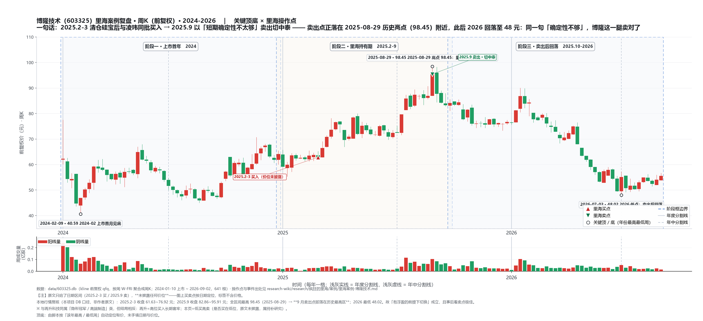

# 里海案例 · 博隆技术（603325）

> **一句话定位**：**2025.2-3 清仓硅宝后的资金去向之一、2025.9 与凌玮一同卖出（切中泰）——但语料对其"买入理由"零披露**，属全案例库中**素材最薄的一页**（比 [[里海案例-中泰股份]] 还薄：中泰至少有"确定性优先"的切换释义，博隆连"当初为什么买"都没有）。唯一可用体系点是**道·频率（有浮盈时主动切换）**。
>
> 本页为 [[里海体系-总览]] 的案例证据层。账户口径=30 万示范账户（资金来自 2025.2-3 清仓硅宝）；**业绩为作者自述口径**，未独立核实；全文引语仅 2 处，其余均为操作层事实。
>
> ⚠️ 与 [[里海案例-凌玮科技]] 是**同一笔切换的两条腿**：博隆/凌玮在 2025 年同一句话里成对出现（买）与成对出现（卖），但作者 2026.3.12 的凌玮专文**只复盘了凌玮，未提博隆** → 博隆的"事后归因"永久缺失。

---

## 一、体系 × 证据 映射（核心表）

### 1. 术——简单 · 底部 · 变化 · 分仓

- **术·分仓/频率（全部素材，作者原话）**：raw-2025-12-31："但我还是卖了，主要是心里的这块石头太重了，所以想切换到其他标的上来，因此在有浮盈的情况下切换了，**就切换到了博隆和凌玮上面来**。"（清仓硅宝的时点为 2025 年 2 月和 3 月）
- **术·简单/底部/变化**：**无任何原文论证**。博隆是"气力输送粉体处理系统"装备公司（本地元数据，见文末附注），符合"机电制造"这一类，但作者是否按"简单/底部/变化"筛出它，档案里找不到证据——**不可代为补写**。

### 2. 道——常识 · 概率 · 赔率 · 频率

- **道·频率（本页唯一体系点，作者原话）**：raw-2025-12-31："有了时间后，我认真琢磨了下持仓的几个标的，**认为博隆和凌玮短期的确定性不太够，于是在有浮盈的情况下，切换到了中泰股份**。"——买（硅宝 → 博隆）与卖（博隆 → 中泰）**两次都是"有浮盈时主动换仓"**，是 2025 年"频率"打法最纯粹的动作样本：不因亏损而砍，而是把资金往"确定性更高"的位置挪。
- **道·常识/概率/赔率**：无原文。

### 3. 能力——价值判断 · 市场先生 · 心性 · 宏观

- **能力·研究恢复（背景）**：5-7 月带娃备考（小升初）、7 月底出国、8 月陪读——9 月"我终于有时间来进行规律性的工作和学习了"之后，才对持仓（含博隆）做出判断（raw-2025-12-31 自述）。**即：买入时（2-3 月）与卖出时（9 月）的信息条件完全不同，前者接近"顺手买"，后者才是"琢磨后卖"。**
- **能力·价值判断/市场先生/心性/宏观**：无原文。

### 4. 弱者思维

- **无从判断（资料不足）**：买卖两侧都没有"看错了能亏多少"的赔率表述，无法映射到弱者体系的任何一条。

### 5. 战略 vs 战术股

- **战术股（推定）**：与凌玮同批买入、同批卖出、同样"确定性不够就走"，节奏为几个月量级；但**作者未明确定性**，此处仅为与凌玮的对照推定，标注存疑。

---

## 二、事件时间线（含出处）

| 时间 | 事件 | 出处 |
|---|---|---|
| **2025.2-3** | **清仓硅宝科技（有浮盈），部分资金"切换到博隆和凌玮上面来"**——买入时点、价位、仓位配比均未披露 | [2025.12.31《2025年投资总结，渐回自己的节奏！》](https://mp.weixin.qq.com/s/6tVGGb0NIXCllTyk-74xPA)；[[里海案例-硅宝科技]] 事件表 |
| **2025.9** | **卖出博隆/凌玮（有浮盈）、切换买入中泰股份**：理由="博隆和凌玮短期的确定性不太够" | [2025.12.31《2025年投资总结，渐回自己的节奏！》](https://mp.weixin.qq.com/s/6tVGGb0NIXCllTyk-74xPA)；[[里海案例-中泰股份]] |
| 2025.12.31 | 年度总结回溯：博隆**未出现在年末持仓**（年末=云图 28700/中泰 23900/利安隆 10100/索通 15800） | 同上 |
| 2026.3.12 | 作者专文复盘凌玮（《错失凌玮科技这只牛股，唉！》）——**全文未提博隆** | [2026.3.12《错失凌玮科技这只牛股，唉！》](https://mp.weixin.qq.com/s/aovgjtsJR6XLL5J46xSCrw)；[[里海案例-凌玮科技]] |
| 2026 至 6.9 | 档案无博隆后续跟踪（2026.2.11 起"不写持仓标的"原则） | 无对应文章（档案至 2026.6.9 无博隆相关文） |

> 完整资金链条：[[里海案例-硅宝科技]]（2025.2-3 清仓）→ **博隆 + 凌玮**（2025 上半年）→ [[里海案例-中泰股份]]（2025.9 承接）→ 年末持仓。

---

## 三、矛盾 / 存疑（照录）

1. **买入逻辑完全缺失（本页根本局限）**：raw-2025 全册中"博隆"仅出现 **2 次**，均为"切换动作"的宾语（2402 行买入、2406 行卖出），**无一句公司主业、财务、估值、买点评述**。本页刻意不填——任何"它为什么符合简单/底部/变化"的论述都是后人补写，非作者原意。
2. **买入/卖出的价位与浮盈幅度未披露**：两处均只有"有浮盈的情况下"。
3. **"短期确定性不太够"的判断依据未展开**：是项目制订单节奏？产能投放？估值？——无原文。
4. **为何凌玮被单独复盘、博隆被略过**：两者同进同出，但 2026.3.12 专文只写凌玮（因凌玮后来翻倍多+"错失"叙事成立），**博隆事后表现是否"不值得写"无从得知**——本页不推测。
5. **定性为"战术股"系推定**：作者未明确表述，见第一节 5。
6. **本地数据层与原文不得混用**：文末附注的公司描述来自本项目 `scripts/config.py`（数据层元数据，非作者原文），仅作查阅索引之用。

---

## 四、六要素验证（本项目分析，非作者原文）

> **本节性质**：拿 2026-09-10《对未来时代发展的脉络和投资机会的思考》提出的**六要素**（优秀企业家 + 资本助力 + 人才储备 + 产品核心竞争力 + 逐步提升市占率 + 出海打开更大的市场）去比对 `data/pdfs/603325/603325_2025_年报.pdf` 的**原文**（页码已标）。
> ⚠️ **作者从未对博隆做过任何基本面分析**（见"矛盾 1"），因此本节是**事后框架比对**，**不能反推成"里海当年就是这么判断的"**。凡本项目推断，均标「本项目判断」。

| 六要素 | 2025 年报原文依据（页码） | 判定 |
|---|---|---|
| **优秀企业家** | **张玲珑**（男 60）董事长兼总经理（2020-10 起）；**公司无控股股东**，实际控制人为一组自然人（张玲珑 / 彭云华 / 林凯 / 林慧 / 刘昶林 / 陈俊 / 梁庆）；年末持股 835.2 万股、年薪 108.62 万；兼任江苏博隆机械董事长、博隆（香港）技术董事、**意大利 GOVONISIM OBIANCA IMPIANTI S.R.L. 董事**；核心搭档彭云华（董事/副总经理 63 岁）、刘昶林（董事/总工程师）（p33 / 35 / 38 / 73-74） | ✅ 有据 |
| **资本助力** | 2024-01-10 上市；募投「聚烯烃气力输送成套装备项目」「研发及总部大楼建设项目」（p15）；连续分红：2023 年度 8,667.1 万、2024 年度 9,000.45 万 + 资本公积转增 2 股/10 股（p46）；2025 年度分红 1.28 亿、支付率 31.2%（**本项目数据层口径，未核验**） | ✅ 有据 |
| **人才储备** | 研发人员 **55 人，占总人数 11.60%**：硕士 6 / 本科 43 / 专科 5 / 高中及以下 1；40-50 岁 22 人为最大组；**无博士**（p22-23）。2025 上半年**成立研究院**，与高校合作（p15）。研发投入 **4,467.13 万元、占营收 3.30%**（全部费用化）（p22） | ⚠️ 中等 |
| **产品核心竞争力** | "全面掌握气力输送、物料处理、工业控制等业务领域内的核心技术"；**国内合成树脂领域合计市占率 30% 以上，煤制聚烯烃细分市占率近 80%**；"国际市场上**少数**成功实现大型聚烯烃装置物料处理系统**整体解决方案**的企业"（p11）；国家级专精特新「小巨人」、上海市「专精特新」、**制造业单项冠军企业创新优秀案例**、绿色工厂（p11）；获中国石油寰球工程「十大优秀供应商」（p15） | ✅ 强 |
| **逐步提升市占率** | ⚠️ **年报只给静态值**（30%+ / 近 80%），未见历年市占率序列 → 需比对 2023 / 2024 年报的同段表述（**待验证**） | ❓ 待验证 |
| **出海打开更大市场** | **境外收入：2024 年 6,422 万（占 5.55%）→ 2025 年 20,584 万（占 15.21%）**，占比提升近 10pct（`data/603325.db` revenue_structure，与年报分地区披露一致）；**双品牌「BLOOM」「GSBI」，由"产品出海"向"品牌出海"升级**（p11）；境外经营实体意大利格瓦尼（欧元记账，p191）；欧元货币资金 1.42 亿 + 欧元应收账款 4,823.55 万（p191） | ✅ **最亮的一条** |

**同期披露的风险（年报原话，p30-32）**：①**收入集中于大型合成树脂建设项目**——超 4,000 万单项目收入占比 **2023 / 2024 / 2025 = 72.36% / 69.84% / 83.89%**（集中度还在上升）；②存货 **15.75 亿元、占资产总额 27.84%**；③项目执行风险；④海外经营风险；⑤市场竞争加剧（"若**竞争对手采取低价策略**"）；⑥地缘政治与国际贸易风险。

**透明度提示（对"能力圈"直接相关）**：年报明确"本报告中部分信息因涉及商业秘密豁免披露，**对部分客户、供应商、项目名称以代称表示**"（p32）——这正对应作者"公司离我远了，我无法紧密地跟踪"（[[里海案例-国林科技]]）的困境：**装备类公司的订单可见度天生就低**。

**小结（本项目判断）**：六要素中**五条有硬证据、一条待验证**；"出海"（5.55%→15.21%）是最亮的一条。但**收入集中度 83.89% + 存货占资产 27.84%** 意味着"单个大项目的节奏"几乎就是业绩的全部——与作者"短期确定性不太够"的卖出理由**方向一致**（**结论一致不代表依据相同，原文未披露依据，勿倒推**）。另据行情复核，他 2025.9 卖出后该股 2026 年最低跌到 48.02 元。

---

## 附：本地数据层（非作者原文，勿与原文混淆）

- `scripts/config.py` `STOCKS["603325"]`：博隆技术（上海博隆装备，2024 年上交所主板上市），国产气力输送粉粒体物料处理系统解决方案龙头，应用于合成树脂（聚烯烃）、煤化工、精细化工、改性塑料等；**国内合成树脂领域合计市占率 30%+、煤制聚烯烃细分市占率近 80%**；2025 年营收 13.54 亿元（+17.1%）、归母净利 4.10 亿元（+38.1%）、净利率约 30%（**本项目数据层口径，未经年报核验**）。
- 本地数据库：`data/603325.db`（存在，可用 `fetcher.py` 更新）。
- **已完成的本地复核（2026-09-11，本项目自研，非作者原文）**：①**行情**（`data/603325.db`，kline qfq，641 根，2024-01-10 上市 ~ 2026-09-02）：2025.2-3 收盘 **61.63~76.92 元**；2025.9 收盘 **82.86~95.91 元**；全区间最高 **98.45（2025-08-29）**，2026 最低 **48.02** → **9 月卖出点就落在历史最高区**，且 2026 明显回落 ⇒ "有浮盈的前提下切换"成立，事后看这一腿**卖对了**。②**PDF 已下载**：`data/pdfs/603325/`（2023-2025 年报、2024-2026 中报、2024-2026 一季报、2024-2025 三季报，共 **11 份**，校验全部 OK）。③**仍待做**：用年报/招股书的"竞争对手分析"按 2026-09-10 六要素（企业家 / 资本 / 人才 / 产品竞争力 / 市占率 / 出海）逐条验证——这才是本页从"待补资料型"升级的下一步。

## 参见

- [[里海体系-总览]] — 体系骨架（本页为"频率 / 有浮盈时主动切换"条目的证据层）
- [[里海案例-凌玮科技]] — 同批买卖的另一条腿（凌玮有事后专文，博隆没有）
- [[里海案例-硅宝科技]] — 资金源头（2025.2-3 清仓硅宝）
- [[里海案例-中泰股份]] — 承接方（2025.9 从博隆/凌玮切出）
- [[里海-业绩归因]] — 2025 战术轮动时代背景（+58.05%）
[[research/index.md]]

---

## 附：周K 复盘图（2024-2026）

> **读图**：主图 = 周K（前复权）+ 三个阶段框（蓝线为阶段切换年）+ 关键顶底（按「该年最高 / 最低周」自动定位取价，非手填）+ 里海操作点（**只标日期区间、不含价位**）；下方为周成交量。横轴每年一格，浅灰实线 = 年度分割线、浅灰虚线 = 年中分割线。
> 【注】**本页买卖价位原文未披露**——图上买卖点按日期定位；价位区间统一来自本项目 DB 复核（**非作者原文**）：2025.2-3 收盘 61.63~76.92 元、2025.9 收盘 82.86~95.91 元、全区间最高 **98.45（2025-08-29）**、2026 最低 48.02。
> **这张图的教学价值**：与再升科技同属"隐形冠军 / 高端制造"，但结局相反——再升是高位买入长期套牢，博隆是**买在什么位置原文未披露、却卖在历史最高区**；同一句"短期确定性不够"，博隆这一腿卖对了（凌玮同一天卖出则卖错了）。
> 生成脚本 `scripts/linhai_chart.py`，数据源 `data/603325.db`（kline 前复权 qfq）。
