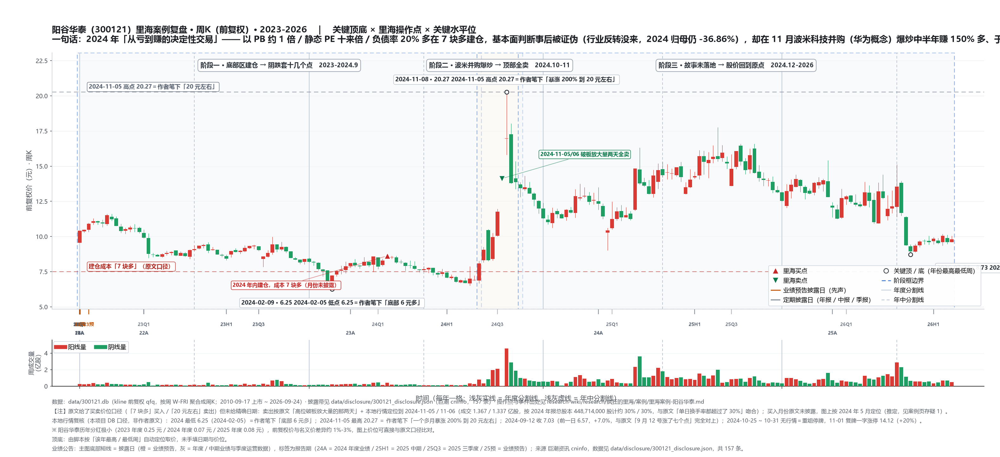

# 里海案例 · 阳谷华泰（300121）

> **一句话定位**：**「安全边际优先于基本面确定性」的头号自述样本**——2024 年内以 **PB 约 1 倍 / 静态 PE 十来倍 / 负债率 20% 多**在「**7 块多**」建仓，**基本面判断事后被证伪**（行业反转没来，2024 归母 1.92 亿、**-36.86%**），却在 11 月**波米科技并购（华为概念）**爆炒中「**半年多一点、收益率 150% 多**」，于**破板放量的两天全部卖光**；作者自评赚的是「行业反转钱 + 市场情绪钱 + **低位信其有的拔估值钱（运气钱）**」，并明言「**为何被爆炒，当时我是完全不知**」。
>
> 本页为 [[里海体系-总览]] 的案例证据层（**弱者体系正例 + 道·赔率 / 市场先生 + 术·底部**）。**账户归属未披露**（示范账户 / 融资账户 / 零花钱账户三者之一原文未指明），业绩为作者自述口径，未独立核实；引语逐字摘录。
>
> ⚠️ 与 [[里海案例-凌玮科技]] 构成**同一体系、两次外生并购爆炒、一成一败**的镜像对照：凌玮错过、阳谷赶上，作者把差别明确归为**运气**。

---

## 一、体系 × 证据 映射（核心表）

### 1. 术——**简单** · **底部** · **变化** · 分仓

- **术·简单（原话，2025.1.17）**：「它属于隐形冠军。其主要生产的产品是橡胶助剂，这种产品主要供给轮胎企业……它主要的一个产品叫**防胶剂**，在这一块是全球龙头。在全球，这一块产销量大概 3 万多吨，阳谷华泰自己就有 2 万吨，**占了整个市场的一半**，这就是隐形冠军的实力。」
  - 本地复核（年报口径）：2024 年报 p14「公司的**防焦剂 CTP 产销量约占全球 60% 以上的市场份额**，保持领先优势」（2025 年报 p15 同）。**作者口述比年报口径更保守**（一半 vs 60%+）。
- **术·底部（原话）**：「这家公司的**市净率已经跌到了 1 倍多一点，静态市盈率只有十来倍**，这是非常具有安全边际的位置了。而且这家公司的**资产负债率很低，只有 20% 多**，所以实际上这家公司没有倒闭风险。」
  - 本地复核（年报 / DB 口径）：2023 年报每股净资产 **7.4554 元**、EPS 0.75 元、资产负债率 **27.38%**；2024 年报 7.6629 元 / 0.47 元 / **21.58%**。**「1 倍多 PB、十来倍 PE、20% 多负债率」三条全部对上。**
- **术·变化（原话，两条）**：①「它的下游，**轮胎企业特别红火**。当时我就想，这种红火态势会不会传导到上游这家公司。」②「这家公司有**新的产能投放**……大体判断，我觉得这家公司的业绩有可能反转。」
  - 事后验证：①**未发生**——2024 中报归母 1.39 亿（上年同期 2.09 亿）、三季报 1.85 亿（上年 2.59 亿）；②**发生了但没带来利润**——「10,000 吨/年橡胶防焦剂 CTP 生产项目」2024 年 7 月实施完毕转固（2025 年报 p66 / p68），而 2024 全年归母 1.92 亿（-36.86%）、产能利用率 82.45%。
- **术·分仓**：仓位未披露，仅「仓位还比较重」。
- **术·底部的「熬」（原话）**：「但就算周期没有来，**1 倍多一点的 PB，我也敢于熬**。毕竟这家公司不会倒闭，要是它倒闭了，整个轮胎行业都会受影响。」

### 2. 道——常识 · 概率 · 赔率 · 频率

- **道·常识**：轮胎离不开助剂 + 全球一半份额 → 用**行业地位常识**替代深研。同时作者明言商业模式一般：「它上游是石油化工企业，下游是大的轮胎企业，它自己是被**夹在中间的铲子型公司**」——**明知商业模式一般仍买，靠的是价格而非质量**。
- **道·概率（原话）**：「其实在我建仓的时候，**我并没有把握住这家公司的周期拐点**，只是基于上述几点因素，在我没有其他更好选择的时候，买入这家公司，**我晚上还是能睡着觉的**。」——概率判断不在「会不会反转」，而在「往下有多大」。
- **道·赔率（向下的量化，原话）**：「最低的时候，**PB 跌到了 0.9 倍附近，静态 PE 跌到了 10 倍附近**……我最多的时候，**套了十几个点**。」
  - 本地复核：2024 最低 6.25（2024-02-05，qfq）；2024 年 8-9 月 6.50-7.03 区间，对应 PB（按 2023 年报 BPS 7.4554）约 **0.84-0.94** ✓。
- **道·频率**：2024 年内买入 → 2024 年 11 月清仓，持有「半年多一点」——典型战术级频率。

### 3. 能力——价值判断 · 市场先生 · 心性 · 宏观

- **能力·价值判断（错了，且不讳言）**：「从最终结果来看，**我对基本面的判断不太准确**，因为行业周期并没有如预期到来。从 2024 年的半年报和三季报来看，整个轮胎行业的红火态势，**并没有传导到上游助剂行业**。」——全案例库中**作者明确承认「基本面判断不准却大赚」的少数样本**。
- **能力·理解市场先生（对了）**：「最后，在**高位破板放大量的那两天，我把筹码全部卖光了**」；2025.1.21 量化顶部特征：「从**底部 6 元多，一个多月就暴涨了 200% 到了 20 元左右**，然后放大量，放量前一天成交量仅仅 1%，而**放量大阴的那两天，单日换手率都超过了 30%**。」
  - 本地复核：2024-11-05 / 11-06 成交 **1.367 / 1.337 亿股**，按 2024 年报总股本 448,714,000 股计约 **30% / 30%** ✓；2024 最高 20.27（11-05）＝作者笔下「20 元左右」。
- **能力·自我心性**：卖出后把利润的一部分取出来消费——「我取了 2 万出来想花在我身上……最终就买了 1 根 100 块钱的鱼竿，**剩下 19900 元，我又存进股市去买了股票**」——落袋即复投，是「绝对收益以标的考核」的日常动作。
- **能力·宏观**：把 9 月末系统性行情单列为收益来源之一：「**大的市场情绪的钱**，是市场行情好带来的整体向好，股票或多或少都会涨，例如九月末那一波」。

### 4. 弱者思维（本页最重要的一条）

- **原则（原话）**：「我**始终把安全边际放在首位而不是基本面的确定性**，追求的是即使看错了也不会大亏。」
- **落地（原话）**：「为什么在 **7 块多**的时候我敢买入呢？这是基于它在行业中的地位，基于它良好的资产负债表，更重要的是基于它当时的估值——**仅有 1 倍 PB 以及 10 来倍 PE**，还酝酿着可能的向上的周期变化。所以在那个价位，**即便看走眼了，只要有耐心坚持，大概率还是能赚钱的**。」
- **收益三分法（原话）**：「第一，就是基本面判断正确，赚到的**行业反转的钱**。第二，大的**市场情绪的钱**……第三，就是利用**低位信其有，市场拔公司估值的钱**……投资阳谷华泰，我把安全边际看得很重，最后也赚到了所谓『**运气**』的钱。」
- **结论（原话）**：「**我们不能僵化地理解价值投资，对不对？**」

> **与 [[里海案例-凌玮科技]] 的镜像（2026.3.12 原话）**：「我 2024 年拿的个股阳谷华泰也是被爆炒，**运气好的是被爆炒的时候我正好有持仓，而且我在顶部跑掉了。但为何被爆炒，当时我是完全不知**，后来我才知道是咋回事。」——**同一体系、同一类外生并购催化，差别在运气**；两页须并读，任取一页都会得出偏颇结论。

### 5. 战略 vs 战术股 / 方法论标签

- **战术股（明确）**：买入依据是「周期可能反转 + 新产能」这类**可验证的战术级变化**，而非几倍空间的战略级重构；到点（破板放量）就走，不恋战。
- **方法论标签＝「安全边际优先于确定性」（弱者体系核心条）+「不能僵化理解价值投资」**。

---

## 二、事件时间线（含出处）

| 时间 | 事件 | 业绩（间隔 / 公告） | 出处 |
|---|---|---|---|
| 2020-2022 | 上一轮增长期：营收 19.43 亿 → 35.17 亿，归母 1.26 亿 → 5.15 亿（作者口述「营收从十九亿增长到三十几个亿，净利润从一个多亿增长到五个多亿」） | — | 本地数据层 / [2025.1.17](https://mp.weixin.qq.com/s/ZOsSWfEcOOtTPXjQXcIEfg) |
| 2023 | 调整期：营收 34.55 亿（-1.78%）、归母 3.04 亿（**-40.96%**）；股价全年 7.83-11.60 | 公告：2023 年报 发布：2024-03-20 | 本地数据层 |
| **2024 年内（月份未披露）** | **建仓**：「7 块多」，依据＝PB 1 倍多 / 静态 PE 十来倍 / 负债率 20% 多 + 下游轮胎红火 + 新产能投放 | 公告：2023 年报 间隔：晚 12 天起（3.20→推测 4 月后） 发布：2024-03-20 | [2025.1.17《阳谷华泰这笔投资结果很好》](https://mp.weixin.qq.com/s/ZOsSWfEcOOtTPXjQXcIEfg) |
| 2024 年内（持有期） | 买入后持续阴跌：最低 PB 0.9 倍附近、静态 PE 10 倍附近；「**最多的时候，套了十几个点**」 | — | 同上 |
| 2024-08-09 / 2024-10-29 | 中报归母 1.39 亿（上年 2.09 亿）、三季报归母 1.85 亿（上年 2.59 亿）→ **轮胎红火未传导上游** | 公告：2024 中报 / 三季报 发布：2024-08-09 / 2024-10-29 | 本地数据层（cninfo 归档日） |
| **2024-09-12** | 大盘不佳而股价涨七个点（本地复核：6.57 → **7.03，+7.0%**），「让我感到很奇怪」 | 公告：2024 中报 间隔：晚 34 天 发布：2024-08-09 | [2025.1.17](https://mp.weixin.qq.com/s/ZOsSWfEcOOtTPXjQXcIEfg) |
| 2024-09-24 起 | 924 行情：「国庆节那一波行情涨完之后，公司股价继续上涨」（9-30 收 9.05） | — | 同上 |
| **2024-10-25 ~ 10-31** | **重组停牌**（本地行情无数据） | — | 本地数据层（kline 缺口） |
| **2024-11-01** | 披露《发行股份及支付现金购买资产并募集配套资金暨关联交易预案》：拟购买**波米科技 100% 股权**（交易对方含海南聚芯、**王传华**、武风云等＝公司实控人一方）；同日复牌一字涨停 14.12（+20%） | 公告：2024 三季报 间隔：晚 3 天 发布：2024-10-29 | 2024 年报 p219（原文）+ 本地行情 |
| **2024-11-05 / 11-06** | 冲高 **20.27** 后破板放大量（1.367 / 1.337 亿股 ≈ 换手 30%）；**作者在这两天把筹码全部卖光** | 同上（间隔 7-8 天） | [2025.1.17](https://mp.weixin.qq.com/s/ZOsSWfEcOOtTPXjQXcIEfg) / [2025.1.21](https://mp.weixin.qq.com/s/I8_335HKbl_6v2qanWuKGw) |
| 2024-11-20 | 自述：「前几天我在阳谷华泰上赚了点小钱，然后我取了 2 万出来……买了 1 根 100 块钱的鱼竿，剩下 19900 元，我又存进股市」 | 公告：2024 三季报 间隔：晚 22 天 | [2024.11.20《最近行情不错啊，赚取了不少绝对收益》](https://mp.weixin.qq.com/s/Ex_1LvifqWYfokpWeG9HyQ) |
| 2024-12-31 | 示范账户 2024 收益 **+4.57%**（30 万 → 105.59 万）；年内 2 月 / 9 月两次触及 -30%；**年度总结操作流水未点名阳谷华泰** | — | [2024.12.31《2024年投资总结，浴火重生的一年》](https://mp.weixin.qq.com/s/LG__ZXX-03UgulvdGvt_xw) |
| **2025-01-17** | 专文复盘（本页主要素材）：「持有时间大概半年多一点，收益率就达到了 **150% 多**，而且仓位还比较重，这笔盈利，可是我 **2024 年整个账户从亏到赚的决定性交易**」 | 公告：2024 三季报 间隔：晚 80 天 发布：2024-10-29 | [2025.1.17](https://mp.weixin.qq.com/s/ZOsSWfEcOOtTPXjQXcIEfg) |
| 2025-01-21 | 《到底是哪些人在顶部放大量买入？》——以本股顶部特征设问，记录游资「博开板后继续暴涨、错了最多亏 10 点无条件止损」的博弈体系 | 公告：2024 三季报 间隔：晚 84 天 | [2025.1.21](https://mp.weixin.qq.com/s/I8_335HKbl_6v2qanWuKGw) |
| 2026-01 初 | 波米交易方式变更：拟「**以现金方式取得波米科技部分股权**」，「**推进节奏及最终结果仍存在一定不确定性**」 | — | 2025 年报 p27（原文） |
| 2026-03-12 | 在凌玮复盘中把本股列为「被爆炒赶上 + 当时不知原因」的对照案例 | — | [2026.3.12《错失凌玮科技这只牛股，唉！》](https://mp.weixin.qq.com/s/aovgjtsJR6XLL5J46xSCrw) |

---

## 三、矛盾 / 存疑（照录）

1. **买入月份与成本口径三约束互斥**：原文只给「7 块多」「持有半年多一点」「最多套十几个点」「最低 PB 0.9 倍附近」；本地行情 2024 年 4-5 月收 7.48-8.85、6-8 月 6.68-8.28。**「7 块多」与「半年多（对应 4-5 月买入）」不能同时满足**；本项目取「4-6 月分批买入、阴跌中补仓、成本摊至 7 块多」为最可能解，图上按 2024-05 定位并标注**推定**。
2. **账户归属与「决定性交易」的张力**：原文称「仓位还比较重」「我 2024 年整个账户从亏到赚的决定性交易」，但 2024 年度总结（12.31）的操作流水**未点名阳谷华泰**，示范账户全年仅 +4.57%、年内两次触及 -30%。**单笔 +150% 与全年 +4.57% 不能简单相加**——可能该笔不在 30 万示范账户，或「仓位较重」为相对口径。两说照录，**不调和**。
3. **「收益率 150% 多」vs「赚了点小钱」**：2025.1.17 称 150%+，2024.11.20 称「赚了点小钱」（取 2 万出来花）。可能为仓位不大或作者自谦，**不作推断**。
4. **卖出「那两天」的精确日**：11-04（16.95 一字、4,703 万股）、11-05（开 20.27 收 19.06、1.367 亿股）、11-06（1.337 亿股）、11-08（8,669 万股）均属巨量区；本项目取 11-05 / 11-06，属**推定**（原文未给日期）。
5. **术语与口径差异**：作者口述「**防胶剂**」＝年报释义「**防焦剂**」（CTP）；作者口述「全球 3 万多吨、自己 2 万吨、占一半」vs 年报「**约占全球 60% 以上**」。引用时以年报为准，作者口述照录。
6. **「华为金牌供应商」未经年报证实**：「波米科技是半导体行业产业链的公司，还是华为的金牌供应商」为作者表述；2024 / 2025 年报仅确认波米为「同一实际控制人」关联方及交易方案，**未提华为**。引用须标注为作者口径。
7. **本地数据层与原文不得混用**：文末附注及本节所有财务 / 行情数据来自 `data/300121.db` 与年报 PDF，非作者原文。

---

## 四、六要素验证（本项目分析，非作者原文）

> **本节性质**：拿 2026-09-10《对未来时代发展的脉络和投资机会的思考》的**六要素**（优秀企业家 + 资本助力 + 人才储备 + 产品核心竞争力 + 逐步提升市占率 + 出海打开更大的市场）比对 `data/pdfs/300121/300121_2024_年报.pdf`（**决策当时可得**）与 `300121_2025_年报.pdf`（**事后验证**）**原文**（页码已标）。
> 作者对本公司的原文分析仅 2025-01-17 一篇（买入三要素 + 卖出理由），**没有做过六要素层面的论证**；本节属**框架补课**，凡本项目推断均标「本项目判断」。

| 六要素 | 年报原文依据（页码） | 判定 |
|---|---|---|
| **优秀企业家** | 创始人 **王传华**（1962 年生，高级工程师，中国橡胶工业协会橡胶助剂专委会副理事长）为实际控制人，直接持股 **93,557,010 股＝20.85%**；一致行动人尹月荣、王文博、王文一（2024 年报 p92 / p212）；现任**董事长兼总经理王文博**（1983 年生，正高级工程师，王传华之子）「目前全面负责公司工作」（p38 / p92） | ✅ 强（创始人 + 二代已接任） |
| **资本助力** | 「10,000 吨/年橡胶防焦剂 CTP 生产项目」**2024 年 7 月实施完毕、转固**（2025 年报 p66 / p68）；2024 年报专列「募集资金投资项目实施的风险」（p4）；可转债利息致 2024 财务费用 **+118.38%** | ✅ 有据（募投已落地，**但落地未带来利润**） |
| **人才储备** | 研发人员 **268 人、占比 12.64%**（2023：263 人 / 13.14%）；本科 124（+29.17%）、30 岁以下 89（+20.27%）；研发投入 **1.1518 亿元、占营收 3.36%**（2024 年报 p22）；2025 年 258 人 / 12.45%、投入 1.2774 亿元（2025 年报 p21-22） | ✅ 稳（投入占比约 3%，与行业「十五五」目标 3.0% 持平） |
| **产品核心竞争力** | **防焦剂 CTP 全球产销量约占 60% 以上**（2024 年报 p14；2025 年报 p15 同）；**继美国富莱克斯、日本四国化成之后第三家掌握连续法不溶性硫磺产业化技术、国内份额第一**（2025 年报 p15）；国家橡胶助剂工程技术研究中心；专利 188 项（发明 135 项）（2024 年报 p15） | ✅ 强（全球级单品地位） |
| **逐步提升市占率** | 主要橡胶助剂设计产能 **28 万吨/年**：产能利用率 **82.45%（2024）→ 87.85%（2025）**（2024 年报 p15 / 2025 年报 p12）；行业侧：5 亿元以上企业 18 家、销售占全行业 81.3%（2024 年报 p14） | ✅ 有据（产能利用率上行；但行业总产值 2025 **-4.35%**，是「集中度提升」而非「蛋糕变大」） |
| **出海打开更大市场** | 境外收入 **15.76 亿元、占 45.94%**（2024，同比 +1.21%，p18）→ 2025 **14.94 亿元、占 43.39%、同比 -5.22%**（2025 年报 p17-18）；泰国子公司 3 万吨高性能橡胶助剂项目**在建**（2025 年报 p12） | ⚠️ 占比高但**收缩**：近一半收入来自海外、2025 绝对额下降；泰国项目是真正的出海增量，尚未投产 |

**该股「作者当年的那个变量」（本页最有价值的一条）**：他等的是「下游轮胎红火 → 传导到上游助剂」。而公开数据是——**量在增、价与利润不增**：2024 年橡胶行业现价工业总产值 5,190.96 亿元（+7.67%）、橡胶助剂总产量 158.79 万吨（+5.96%），但**助剂行业总产值仅 +0.13%、2025 年 -4.35%**（2024 年报 p13-14 / 2025 年报 p15）；公司层面 2024 营收 -0.69%、归母 -36.86%，且**分季度归母逐季走低**（8,122 / 5,758 / 4,616 / 716 万元，2024 年报 p11）。**用年报能验证的是「传导没发生」，验证不了「会不会有人来炒它」**。

**结果的反差才是教学点（本项目判断）**：让他赚 150% 的**不是**他等的那个变量，而是 11 月的并购公告；而这份并购到 2026 年 1 月仍未落地（改为现金收购部分股权、仍在磋商，2025 年报 p27），2026-07-20 股价最低 **8.73** ——**几乎回到他的建仓价**。所以这一笔的完整读法是：**「买得低」让他立于不败，「熬得住」让他等到了运气，「顶部走」让他把运气变成了利润；而若他当年赌的是「并购一定成」，同样的持有期会是另一番结果。**

---

## 附：本地数据层（非作者原文，勿与原文混淆）

- `scripts/config.py` `STOCKS["300121"]`：阳谷华泰（山东阳谷华泰化工，2010 年创业板上市），橡胶助剂（防焦剂 CTP / 促进剂 / 不溶性硫磺 / 防护蜡 / 胶母粒 / 均匀剂）。**2025 年营收 34.43 亿（+0.37%）、归母 1.97 亿（+2.72%）、毛利率 17.36%、资产负债率 19.55%**（本项目数据层口径）。
- 本地数据库：`data/300121.db`（2026-09-26 拉取；kline 3841 根 2010-09-17 ~ 2026-09-24；income 70 / balance 68 / cashflow 70 / indicators 1200 / dividend 15 条）。
- 年报 PDF：`data/pdfs/300121/`（2010-2025 年报 + 各期中报 / 一季报 / 三季报 + 2026 中报，共 **47 份**，校验全部 OK）。
- 披露日历：`data/disclosure/300121_disclosure.json`（巨潮 cninfo，**157 条**；A 股口径**仅收录定期报告、未收录重组类临时公告** → 波米科技的停复牌与预案日由 2024 年报 p219 + 本地 kline 缺口定位）。
- **已完成的本地复核（2026-09-26，本项目自研）**：①**行情**：2024 最低 6.25（2024-02-05）／最高 20.27（2024-11-05）；2024-09-12 收 7.03（+7.0%，与原文「涨了七个点」逐笔对上）；11-05 / 11-06 成交 1.367 / 1.337 亿股（≈换手 30%）；10-25 ~ 10-31 停牌。②**估值三条件**：BPS 7.4554（2023）→ PB 0.82-1.15（2024 年内价格区间）；EPS 0.75 → 静态 PE 8.3-11.5；资产负债率 21.58%-27.38%。③**财务**（营收 / 归母 / 分季度 / 境外收入 / 产能利用率 / 研发人员均取自年报原文页码）。
- **仍待做**：波米科技收购的最终结果与对价（2026 年内跟踪）；「华为金牌供应商」的独立信源；阳谷华泰在作者三个账户中的归属（存疑 2）。

## 参见

- [[里海体系-总览]] — 体系骨架（本页为「安全边际优先于确定性」头号正例）
- [[里海案例-凌玮科技]] — 镜像对照（同一体系、同样外生并购爆炒，凌玮错过 / 阳谷赶上）
- [[里海案例-花园生物]] — 同为「催化剂点火」型战术买点（催化剂买点成立、抉择果断性失分）
- [[里海案例-川环科技]] / [[里海案例-秦安股份]] — 战术股「到点就走」的其他样本
- [[里海案例-云南能投]] — 同为「按模型选外地标的、捞一把就跑」
- [[里海-业绩归因]] — 2024 示范账户 +4.57% 的年度背景
[[research/index.md]]

---

## 附：周K 复盘图（2023-2026）

> **读图**：主图 = 周K（前复权）+ 三个阶段框（蓝线为阶段切换年）+ 关键顶底（按「该年最高 / 最低周」自动定位取价，非手填）+ 里海操作点；下方为周成交量。横轴每年一格，浅灰实线 = 年度分割线、浅灰虚线 = 年中分割线；底部短线为定期报告披露日（灰），标签为报告期。
> 【注】**买入月份原文未披露**（只知「7 块多」「半年多一点」）——图上按 2024-05 定位并标「推定」；卖出按原文「破板放大量那两天」定位到 2024-11-05 / 11-06（本地口径换手约 30%）。价位口径来自原文（7 块多 / 20 元左右）与本项目 DB 复核（**非作者原文**）：2024 最低 6.25、2024-11-05 最高 20.27、2026-07-20 最低 8.73。
> **这张图的教学价值**：左边是他等的那段——**基本面判断错了（行业反转没来），股价先跌到 PB 0.9、套十几个点**；中间是**他没预料的波米并购爆炒**（一字板 → 20.27 破板放量）；右边是**故事没落地后股价回到建仓价附近**。三件事拼在一起，才是「安全边际 + 熬 + 顶部走」的完整含义：**买得低决定他不会输，运气决定他赢多少，卖点决定运气能不能落袋。**
> 生成脚本 `scripts/linhai_chart.py`，数据源 `data/300121.db`（kline 前复权 qfq）。
