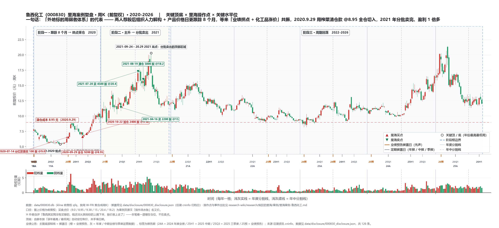

# 里海案例 · 鲁西化工（000830）

> **一句话定位**："简单公司困境反转"模型的**正面完整闭环**标本——高手荐股后**组织人力深度解构 + 紧密跟踪主逻辑 8 个月**，等来"业绩拐点 + 产品涨价"确定性，示范账户低位重仓、卖出在顶部区域；同时是"外地标的用弱者体系财务跟踪"打法的代表，以及"钱没从别的标的上腾下来导致**没买够**"的稀缺性遗憾。
>
> ⚠️ 注意：常被误记的"过早清仓换再升卖飞"**不是鲁西**（鲁西卖得很成功，见"三、矛盾存疑"），真正"没熬住小赚卖飞"的是[[里海案例-常宝股份]]与[[里海案例-秦安股份]]。
>
> 本页为 [[里海体系-总览]] 的案例证据层。业绩为**作者自述口径**，未独立核实；引语逐字摘录，出处见各条目。

## 〇、账户口径先分清（鲁西在三个场景出现，勿混）

| 账户/场景 | 鲁西操作 | 口径意义 |
|---|---|---|
| **30 万示范账户**（公开主口径） | 2020.7.14 首买 100 股@9.0（分红款）→ **9.29 用榨菜清仓钱 @8.95 全仓买入 9200 股** → 10.22 加 2400 股@9.38 → 11700 股；2021 年 4.16/7.20/8.19 分批卖完 | 年度收益 50%+ 的主口径 |
| **长辈"善意的谎言"账户** | 2021.2.28 文"有一半仓位买的鲁西化工，结果涨到 30%…证券公司喊卖我纹丝不动" | 作者代管的被资助账户 |
| **大姑爷账户**（2025.7.8 复盘） | 初始约 7.9 万，"大赚三只=鲁西、太极、再升" | 2025 年账户复盘 |

---

## 一、体系 × 证据 映射（核心表）

### 1. 术——**简单** · **底部** · **变化** · **分仓**

- **术·简单**：周期化工本属"专业知识深"的行业，但作者用弱者视角化繁为简——"你说鲁西化工，专业知识需要这么深，很多化工产品的名字我都叫不来，我就是个门外汉"（[2021.3.26《选股模型！》](https://mp.weixin.qq.com/s/bK_gAhd4Nznny00LJuMBUQ)原文）；判断锚=央企/地方国企"怎么都不可能破产"。
- **术·变化**：核心变量两个——①**股权划给中化集团解决资产负债率**（"股权划给中化集团后，资产负债率的问题就解决了…要投 120 个亿"，2021.3.26）；②**主要化工产品涨价**。变化确认点=2020.9.28"跟踪模型的数据提醒我……业绩拐点到了，主要产品价格开始大幅上涨"。
- **术·变化（跟踪模型具体在跟什么，2026-09-24 补）**：**日频的化工产品价格表**，作者具名的品种只有 **双氧水** 与 **PC（聚碳酸酯）**——"**鲁西化工我每天都搜集公司的产品价格，最近双氧水和 PC 的价格涨得比较猛，不知道大家看了没有，涨了多少我都比较清楚，就是跟踪嘛**"（[2020.11.13《主播疯狂的里海已上线（上）》](https://mp.weixin.qq.com/s/2fgh8H3w1UQca-cIsB0V_g)，10.20 中国铁道出版社直播问答实录）。同篇给出建模通则（**这段是"四段式"第 ③ 段的原始表述，见 [[方法论/里海-四段式工作流]]**）："分析一家公司要有抽丝剥茧的精神，抓主要逻辑……关键是你要把一家公司从这么多资料当中**总结出一个核心逻辑出来，然后你才明白这家公司的变量，业绩变量**。比如说业绩增长是由主要产品的价格决定的，那么你要**每天跟踪它的主要产品的价格走势，这个有行业网站是可以收集到的**；再比如说业绩主要是由在建工程转固产生效益来决定的，那就要去跟踪在建工程的进度的情况，跟踪的渠道很多，通过网站，通过行业的一些分析，而且你也可以打电话去问这家公司，也可以参加股东会了解，也可以在互动易上问。"
**同篇还给出"变量会切换"的榨菜示范**（提价 → 渠道），见 [[里海案例-涪陵榨菜]]。
- **术·底部**：买点 8.95 元=阶段最低点区（2021.1.1 文："几乎在鲁西化工的阶段最低点买入"）；此前"第一波 7 元到 12 元，我没介入"——两次底部中只吃确定性后的那一段。
- **术·分仓/仓位**：示范账户鲁西一度近满仓单吊（11700 股占 30 万的大头）；但作者坦承"**鲁西其实我没有买够的**，钱还没从其他标的上腾下来，股价就上去了"（raw-2021-1.1）——分仓 vs 错过加仓的张力。

### 2. 道——常识 · 概率 · 赔率 · 频率

- **道·常识**：央企不破产=向下有底。"（2021.3.26）公司简单垮不了……至少亏不了，赚钱就可以赚很多"——低位信其有。
- **道·赔率**：8.95 元买入时，向下=央企债务问题已解决+化工周期底部，向上=产品涨价弹性——"基本上买在低位买得早"。
- **道·概率**：不押注单点，而是"跟踪 8 个月主逻辑（产品价格日更）+ 业绩拐点实锤后才重仓"——高概率确认后的出手。
- **道·频率**（正面）：**榨菜→鲁西切换被作者封为"去年最好切换"**："50 块卖榨菜、9 块钱切鲁西（100 万→200 万）"（2021.8.12 文）——三率顺序论下的经典频率操作：标的 A 逻辑走完清仓的钱，立刻接到逻辑刚启动的标的 B。

### 3. 能力——价值判断 · 市场先生 · 心性 · 宏观

- **能力·价值判断**（完整流程）：高人荐股→"我组织了人力对该股进行了深度解构，梳理出核心逻辑，然后紧密跟踪核心逻辑长达 8 个月"→等来买点重仓（raw-2021-1.1）。不是抄作业，是把别人的引子做成自己的能力圈。
- **能力·市场先生**：卖点=业绩预告预增 50 倍"也就一个板就没了/见光死"（2021）——印证"股价领先基本面、业绩最好时反而是卖点"；对"数据好到极致=预期price in"的警觉。
- **能力·心性**：卖出前三批犹豫（4.16 只卖 2200 股、7.20 卖 4500、8.19 才清完），与"几乎卖在顶部区域"的自评并存——卖点把握即便成功也非一次性决断。

### 4. 根——认知（可练）+ 修行（不可量化）

- **根·认知**："榨菜因为我跟踪较深，所以总是能先知先觉，提前于市场买入，在喧嚣的时候卖出，然后几乎在鲁西化工的阶段最低点买入"（raw-2021-1.1）——**对 A 的深度跟踪红利，会溢出到对 B 的买点时机上**（腾出来的钱正好接在 B 的阶段底）。能力圈是叠加复利的。
- **根·修行**（次要教训）：**"没买够"**=判断正确但资金被别的标的占用，错过把仓位加到极致的机会——"好机会来了手里没钱"同样是弱者体系的隐性成本。

### 5. 弱者思维

- 鲁西=**弱者体系·外地财务筛选**的代表（与秦安同模式，但更"弱"）："外地的像鲁西化工这种，我是采用弱者体系的，通过一些财务指标的跟踪来发现是不是有这种机会"（2020.11 文）。不搞行业深研，靠"财务跟踪 + 简单逻辑（央企不会破产）+ 产品价格日更"三个弱信号。
- **弱者筛选端的具体做法（2026-09-24 补）**：季频财务指标筛"**业绩已好转 + 股价仍在底部**"→ 反向研究基本面——"公司去年第三季度业绩出现了好转，但是股价仍然在底部，那这种股我就会把它提出来，其实这种选股你在 **i问财** 上面，在东方财富网有些软件都可以发现，**找出来之后再反向去研究基本面**。就是基本面通过季度跟踪发现已经有好转了，然后股价还没起来那是不是市场没发现呢"（[2020.11.15《主播疯狂的里海已上线（下）》](https://mp.weixin.qq.com/s/nzsdA3lbuWOs0Yaf4mXZ5w)）；"看财报要细到季报吗？肯定要细到季报啊"（同篇）。
- **解构的颗粒度与材料清单（2026-09-24 补）**：①**500 字原则**——"分析公司不需要长篇大论，只需要把主逻辑搞明白就行了，500 字如果把主逻辑搞不明白，就不需要再深入下去了"（[2020.11.12](https://mp.weixin.qq.com/s/n-GXHqW2_VHyNU9pYlGJ4w)）；②材料="三年以内的企业一定要看**招股说明书**，三年以上的一定要看最近的**年报、半年报以及重要的公告**（并购、定增），要找**券商的深度研报**"（2020.11.15 下）。
- **"组织人力"的实际形态（2026-09-24 补）**：找人做跟踪整理、自己亲自搭模型——"虽然是可以通过找人来负责跟踪整理的事情，但每个股都需要**自己亲自过手，亲自来进行跟踪模型的搭建**"（[2021.2.23《我只是搬运工！…》](https://mp.weixin.qq.com/s/gtVg_DZ8StruAZekXc0fqg)）；"现在我又扩大了一下，**有几个人在帮着我研究**"（2020.11.15 下）；2022 年自述读者"交来了 **150 家公司的研究报告**……对于经过初筛的标的建立跟踪模型"。
- 对垒强者打法：本地（重庆）标的用"强者视角/常年调研"（秦安、太极），外地用弱者体系——**地域分工决定能力边界**。

### 6. 战略 vs 战术股

- **鲁西=周期困境反转，波段/战术属性**：到顶后分批卖出、未恋战成战略长持。2025 年作者回顾语气印证："运气好，像我之前操作过的鲁西化工，买入后就涨，一去不回头了；运气不好，像常宝一样等了小一年，然后才真正起来有赚钱效益。"（raw-2025）
- 对照：鲁西卖对 vs 常宝/秦安没熬住小赚——**同一套"底部+变化"模型，卖点执行差异决定单笔收益量级**。

---

## 二、事件时间线（含出处）

| 时间 | 事件 | 业绩（间隔 / 公告） | 出处 |
|---|---|---|---|
| 2020 年（高人首次荐股） | 一位高人首次提起鲁西；作者"组织了人力对该股进行了深度解构，梳理出核心逻辑"，紧密跟踪长达 8 个月 | — | [2021.1.1《2020年投资总结之二：反思和进步！》](https://mp.weixin.qq.com/s/lDUHkaoyNkayl0NWm8YCcQ) |
| 2020.7.14 | 示范账户用分红资金 @9.0 首买鲁西 100 股 | 公告：2019 年报 间隔：晚 91 天 发布：2020-04-14 | [2020.12.31《收益率88.14%，2020年操作流水账全记录》](https://mp.weixin.qq.com/s/aUa1uJOGN1XWOK9eoU1uKA) |
| **2020.9.28** | 跟踪模型提示"9 月下旬起业绩拐点到了、主要产品价格开始大幅上涨、股价走出阶段性底部" | 公告：2020 半年报 间隔：晚 34 天 发布：2020-08-25 | [2021.2.23《我只是搬运工！今天给大家说说一个年化100%以上的密码！》](https://mp.weixin.qq.com/s/gtVg_DZ8StruAZekXc0fqg) |
| **2020.9.29** | **榨菜清仓的钱 @8.95 全仓买入鲁西 9200 股**（卖出榨菜腾资金正好遇鲁西最佳买点） | 公告：2020 半年报 间隔：晚 35 天 发布：2020-08-25 | [2020.12.31《收益率88.14%，2020年操作流水账全记录》](https://mp.weixin.qq.com/s/aUa1uJOGN1XWOK9eoU1uKA) |
| 2020.10.22 | 卖抄底再升 1500 股 @15.45 → @9.38 再买鲁西 2400 股 | 公告：2020 半年报 间隔：晚 58 天 发布：2020-08-25 | [2020.12.31《收益率88.14%，2020年操作流水账全记录》](https://mp.weixin.qq.com/s/aUa1uJOGN1XWOK9eoU1uKA) |
| 2020.11.13（直播 10.20） | 直播问答实录首度披露**跟踪模型的具体内容**："鲁西化工我每天都搜集公司的产品价格，最近双氧水和 PC 的价格涨得比较猛，不知道大家看了没有，涨了多少我都比较清楚，就是跟踪嘛"；同篇给出建模通则（产品价格日更 / 在建工程进度 / 互动易·股东会·电话问公司） | 公告：2020 三季报 间隔：晚 17 天 发布：2020-10-27 | [2020.11.13《主播疯狂的里海已上线（上）》](https://mp.weixin.qq.com/s/2fgh8H3w1UQca-cIsB0V_g) |
| 2020.11.15（直播 10.20） | 明确外地标的用弱者体系："外地的像鲁西化工这种，我是采用弱者体系的，通过一些财务指标的跟踪来发现是不是有这种机会"；筛选法=季报好转+股价仍在底部（i问财/东财）→ 反向研究基本面 | 公告：2020 三季报 间隔：晚 19 天 发布：2020-10-27 | [2020.11.15《主播疯狂的里海已上线（下）》](https://mp.weixin.qq.com/s/nzsdA3lbuWOs0Yaf4mXZ5w) |
| 2020.12.31 | 年末示范账户持鲁西 11700 股；2020Q4 鲁西获季度正收益 | 公告：2020 三季报 间隔：晚 65 天 发布：2020-10-27 | [2020.12.31《收益率88.14%，2020年操作流水账全记录》](https://mp.weixin.qq.com/s/aUa1uJOGN1XWOK9eoU1uKA) |
| 2021.1.1 | 年度复盘：榨菜→鲁西切换"使我在 4 季度获得了 19 个点的季度正收益"；鲁西"短短一个季度获得了 50 个点左右的收益"；坦承"**鲁西其实我没有买够的**" | 公告：2020 三季报 间隔：晚 66 天 发布：2020-10-27 | [2021.1.1《2020年投资总结之二：反思和进步！》](https://mp.weixin.qq.com/s/lDUHkaoyNkayl0NWm8YCcQ) |
| 2021.2.23 | 公开方法论="**底部反转股的接力**"；鲁西作为样本："建立了跟踪模型，跟踪长达八个月，等到了共振点……到目前差不多 5 个月，股价已经翻倍，个人收益接近翻倍" | 公告：2020 三季报 间隔：晚 119 天 发布：2020-10-27 | [2021.2.23《我只是搬运工！今天给大家说说一个年化100%以上的密码！》](https://mp.weixin.qq.com/s/gtVg_DZ8StruAZekXc0fqg) |
| 2021.2.28 | 长辈账户"有一半仓位买的鲁西化工，结果涨到 30% 的时候这亲戚给我打电话了……喊他赶紧把这票卖了，我口头上说好好好，然而我纹丝不动" | 公告：2020 三季报 间隔：晚 124 天 发布：2020-10-27 | [2021.2.28《惨了，高位接盘基金了！》](https://mp.weixin.qq.com/s/BkbcPre7tGoRUlF68Ccwsw) |
| 2021.3.26 | 《选股模型》：鲁西=模型 3"简单公司困境反转"代表（与秦安、常宝并列） | 公告：2020 三季报 间隔：晚 150 天 发布：2020-10-27 | [2021.3.26《选股模型！》](https://mp.weixin.qq.com/s/bK_gAhd4Nznny00LJuMBUQ) |
| 2021.4.16 | 15 元卖鲁西 2200 股；同日 14.81 / 14.74 元买入太极集团 2100 股 + 100 股 | 公告：2020 三季报 间隔：晚 171 天 发布：2020-10-27 | [2022.1.2《2021年投资总结~轻舟已过万重山!》](https://mp.weixin.qq.com/s/Gon_KWoIDADby0juYneH-Q) |
| 2021.7.20 | 20.4 元卖鲁西 4500 股；11.57 元买再升 5000 股 + 9.3 元二次建仓秦安 3800 股 | 公告：2021 一季报 间隔：晚 83 天 发布：2021-04-28 | [2022.1.2《2021年投资总结~轻舟已过万重山!》](https://mp.weixin.qq.com/s/Gon_KWoIDADby0juYneH-Q) |
| **2021.8.19** | **18.2 元卖鲁西最后 5000 股——"就此，鲁西化工全部卖出，盈利 1 倍多"** | 公告：2021 半年报 间隔：晚 21 天 发布：2021-07-29 | [2022.1.2《2021年投资总结~轻舟已过万重山!》](https://mp.weixin.qq.com/s/Gon_KWoIDADby0juYneH-Q) |
| 2021 年末 | "单算我今年个股的收益的话，鲁西化工、太极集团和涪陵电力，都是 50% 以上"；自评"今年的鲁西虽然不是十分完美，也基本上卖在了顶部区域" | — | [2022.1.2《2021年投资总结~轻舟已过万重山!》](https://mp.weixin.qq.com/s/Gon_KWoIDADby0juYneH-Q) |
| 2021.8 后 | 卖出鲁西后"当时手里没有非常满意的标的而盲目买入"→**二次进入秦安**成当年两笔失误之一（另一笔=再升科技） | — | [2022.1.2《2021年投资总结~轻舟已过万重山!》](https://mp.weixin.qq.com/s/Gon_KWoIDADby0juYneH-Q) |
| 2025.7.8 | 大姑爷"善意谎言"账户复盘："我大赚只有三只，分别是鲁西、太极和再升" | 公告：2024 年报 间隔：晚 73 天 发布：2025-04-26 | [2025.7.8《给大姑爷又孝敬了8.5万元》](https://mp.weixin.qq.com/s/nb9GW56mcesmOFD9CHVyCw) |

> **「业绩（间隔 / 公告）」列口径**：= 该行事件日期与「最近一期已披露定期报告」的关系（只取年报 / 半年报 / 一季报 / 三季报，不含业绩预告与快报）；发布日 = 巨潮资讯 cninfo 归档日，数据见 `data/disclosure/000830_disclosure.json`。
> **出处校正（2026-09-13）**：原表将"2020.9.28 跟踪模型提示"与"2021.1.1 复盘（不到 5 个月翻倍）"均标 `raw-2021-1.1`；回查原文后——**"2020.9.28 跟踪模型"与"5 个月翻倍"实出 2021.2.23《我只是搬运工！…》**，2021.1.1《2020年投资总结之二：反思和进步！》对应的是"一个季度 50 个点"与"没买够"，两者已按原文拆为两行。

---

## 三、矛盾 / 存疑（照录）

1. **常见归因错误（重要纠偏）**：把"过早清仓换再升、卖飞"安到鲁西头上是**错位**。语料中鲁西是**卖得成功的**（"基本上卖在了顶部区域"、盈利 1 倍多、单年 50%+）；真正"没熬住、小赚卖飞"的是**常宝与秦安**（2024 年自述"秦安和常宝我没怎么赚钱就出来了……问的人多了……草率决定导致操作失真"）。鲁西唯一"遗憾"是**没买够**（2020.7.20 卖鲁西换再升那 4500 股仅是部分仓位，非"为再升清仓鲁西"）。两案叙事需分开。
2. **卖出后冲动买入秦安**：卖鲁西腾出的钱，因"标的荒"冲动二次买入秦安（忽略其期货因子）成 2021 失误——**鲁西本身成功，错在卖出后的下一步**。
3. **买入起点口径**：示范账户严格首买是 2020.7.14 的 100 股（@9.0 分红款），2020.9.29 才是重仓切入；"2020 年 9 月起买入"属近似表述。
4. **分批卖出理由**：4.16 为何只卖 2200 股、7.20/8.19 才清完，原文未逐笔说明卖出理由（从卖价 15→20.4→18.2 看是越涨越卖+回撤清仓），待核。
5. **长辈账户细节**：鲁西具体买入价位/股数未公开，仅有"一半仓位、涨 30%"自述。
6. **文章命名**：raw 中 2021.1.1 文原题见合集 txt，wiki 归纳为"年度总结/复盘"；文中自述"短短一个季度获得 50 个点左右的收益"与其"9.28 建仓→12.31"时点一致，无矛盾。

7. **出处链接补全（2026-09-11）**：本页全部 `YYYY.M.D《标题》` 式出处已回查 raw 合集（`raw/research/疯狂的里海/`）补 mp.weixin.qq.com 原文链接（本轮新增/补齐 1 处）。其中作者简写标题已按 raw 原题校正：2021.3.26《选股模型》→[《选股模型！》](https://mp.weixin.qq.com/s/bK_gAhd4Nznny00LJuMBUQ)。（注：该轮**未覆盖 `二、事件时间线` 表格**——其上出处当时仍是内部简称，见下条。）

8. **时间线出处补全 + 两处校正（2026-09-13）**：`二、事件时间线` 原出处为 `raw-2021-1.1` / `时间线-2020 流水` / `raw-2021 总结` 等内部简称，无法追溯；本轮逐条回查 raw 合集换为 `YYYY.M.D《标题》` + mp.weixin.qq.com 链接。同时校正两处出处错标：①**2020.9.28「跟踪模型提示」**原标 `raw-2021-1.1`，实出 **2021.2.23《我只是搬运工！今天给大家说说一个年化100%以上的密码！》**（"跟踪模型的数据在9月28日提醒我从9月下旬开始，公司的业绩拐点到了……"）；②**"不到 5 个月股价翻倍、个人收益接近翻倍"**亦出该篇，非 2021.1.1——2021.1.1《2020年投资总结之二：反思和进步！》对应的是"短短一个季度获得了 50 个点左右的收益"与"鲁西其实我没有买够的"。原表将两者并作 2021.1.1 一行，已按原文**拆分为两行**。

9. **跟踪模型只公开到"产品级"，字段未公开（2026-09-24）**：作者具名的跟踪品种仅**双氧水、PC**两个，且"每天都搜集公司的产品价格"为 2020.11.13 直播自述（买入后）。**模型的表格结构、预警阈值、数据抓取的行业网站名、除双氧水/PC 外还跟踪哪些产品，全部未公开**——引用时不得外推（鲁西主营还有己内酰胺、甲酸、烧碱、多元醇等，但语料无记载）。同理，"解构"也未公开过鲁西的驱动因子清单全文，只能从 2021.2.23 / 2021.3.26 的表述反推为"负债率解决 + 产品价格"两条。

10. **「业绩（间隔 / 公告）」列的来源（2026-09-13）**：本列由 `scripts/tools/fill_perf_column.py` 依据 `data/disclosure/000830_disclosure.json`（巨潮资讯 cninfo 定期报告归档日，`scripts/tools/fetch_disclosure_cn.py` 拉取）自动生成；事件日期无法解析到「日」的行填 `—`。同批已为 22 个案例页统一补此列（涪陵榨菜 / 太极集团两页原有手工数据保持不变）。

11. **2020.11.13 / 11.15 两行的日期口径（2026-09-24）**：两篇为同一场直播（2020.10.20）的问答实录，**发布日**分别为 11.13 / 11.15，故时间线按发布日排序、间隔列按发布日计算（晚 17 / 19 天，基准=2020 三季报 2020-10-27）。若改按直播日 10.20 计，则基准为 2020 半年报（2020-08-25）、间隔 56 天——两种口径都成立，本页统一取**发布日**。

## 参见

- [[里海体系-总览]] — 体系骨架（模型 3 简单公司困境反转：秦安/常宝/鲁西为代表）
- [[方法论/里海-四段式工作流]] — **本案例是"筛→解构→建模→共振"四段式唯一被作者完整自述跑通的样本**（跟踪模型的具体内容见该页）
- [[里海-2444投资体系]] — 2444 深解
- [[里海案例-太极集团]] / [[里海案例-秦安股份]] — 同模板对照（2021.7.20 卖鲁西后资金流向与秦安二次买入失误）
- [[里海案例-常宝股份]] — "没熬住卖飞"对照组（鲁西=卖对 / 常宝=卖早）
- [[里海案例-涪陵榨菜]] — 卖出榨菜腾资金→9.29 鲁西买点（教科书式换仓）
- [[疯狂的里海]] — 人物画像
[[research/疯狂的里海/案例/里海案例-涪陵电力.md]] · [[research/index.md]]

---

## 附：周K 复盘图（2020-2026）

> **读图**：主图 = 周K（前复权）+ 阶段框（蓝线为阶段切换年）+ 关键顶底 + 里海买卖点（文字为案例页原文「当时成交名义价」，与前复权价口径不同）+ 关键水平位。
> 主图下方「披露带」= 定期报告 / 业绩预告披露日（橙 = 业绩预告 · 快报，灰 = 年报 / 中报 / 一季报 / 三季报，标签 = 两位年份 + 报告期，如 21A / 21H1 / 21Q3）；底部 = 周成交量。三块面板共用同一时间轴。
> 生成脚本 `scripts/linhai_chart.py`（`SPECS["000830"]`），数据源 `data/000830.db`（kline 前复权 qfq）+ `data/disclosure/000830_disclosure.json`（巨潮 cninfo 归档日）。
> 顶底由脚本按「该年最高 / 最低周」自动定位，未手填日期；买卖点价位未披露者只标日期、不标价。
