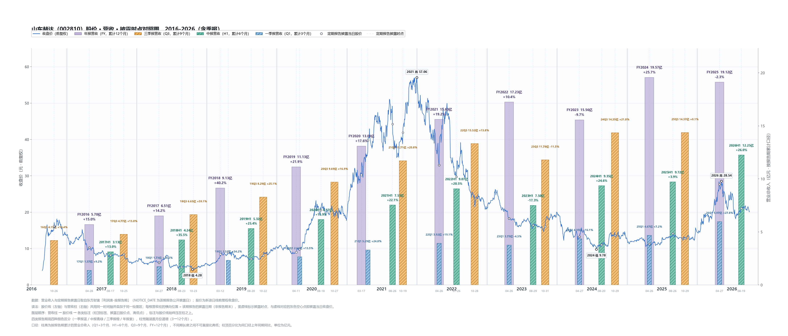

# 山东赫达（002810）· 营收 × 披露时点 × 股价 对照图（2016-2026）

> 一张图看「营收什么时候被市场知道」与「当时股价在什么位置」的时间关系。



## 读法

- 单面板叠加：左轴＝前复权收盘价（元），右轴＝营业总收入（亿元），两者共用同一时间轴。
- 每根营收柱的**横向位置＝该期报告的实际披露日**（NOTICE_DATE），不是报告期末。
- 柱宽随涵盖月份递增（Q1 22 天 → FY 46 天）；四色＝一季报蓝 / 中报青绿 / 三季报橙 / 年报紫。
- 柱高为**按报告期累计**营收，不同口径（3 / 6 / 9 / 12 个月）之间不可直接比高低；柱顶百分比为同口径上年同期同比。
- 股价线与所有标注压在柱之上（同一 axes 内 zorder 分层：柱 → 线 → 标注）。
- 2016-08-26 上市，此前披露的报告期未入图。

## 关键读数（单位：亿元 / 元）

| 报告期 | 累计营收 | 同比 | 披露日 | 披露日收盘（前复权） |
|---|---|---|---|---|
| FY2016 | 5.70 | +15.0% | 2017-04-28 | 10.23 |
| FY2017 | 6.51 | +14.2% | 2018-04-27 | 6.12 |
| FY2018 | 9.13 | +40.2% | 2019-03-12 | 8.45 |
| FY2019 | 11.13 | +21.9% | 2020-04-11 | 9.00 |
| FY2020 | 13.09 | +17.6% | 2021-03-17 | 30.29 |
| FY2021 | 15.60 | +19.2% | 2022-04-26 | 32.94 |
| FY2022 | 17.23 | +10.4% | 2023-04-26 | 18.30 |
| FY2023 | 15.56 | −9.7% | 2024-04-27 | 13.26 |
| FY2024 | 19.57 | +25.7% | 2025-04-26 | 11.24 |
| FY2025 | 19.12 | −2.3% | 2026-04-27 | 27.70 |
| 2026H1 | 12.25 | +26.0% | 2026-08-19 | 21.01 |

要点（均以表中数据为据）：

- **营收只在 2023 年出现一次负增长（−9.7%）**，2024 恢复 +25.7%，2025 微降 −2.3%，2026H1 重回 +26.0%。
- **营收新高与股价低点同时出现**：FY2024 营收 19.57 亿（历史最高）于 2025-04-26 披露，当日收盘仅 11.24 元；FY2025 于 2026-04-27 披露时已回到 27.70 元。
- **业绩最好的年份，股价高点先到**：2021 年内收盘高点 57.06 元（前复权）出现在 FY2021（+19.2%）披露之前；该年报披露时（2022-04-26）股价 32.94 元。
- **披露节奏**：年报集中于 04-26 ~ 04-28（FY2018 例外，03-12），中报 8 月中下旬，三季报 10-19 ~ 10-31，一季报多与上年报同日披露。

## 复现

```bash
.venv/Scripts/python .codebuddy/skills/revenue-price-timeline/scripts/revenue_price_timeline.py \
  --code 002810 --name 山东赫达 --end 2026-09-30 \
  --extremes 2018:low,2021:high,2024:low,2026:high \
  --out research-wiki/research/白马/002810/assets/revenue-price-timeline.png
```

出图脚本已沉淀为 skill：`revenue-price-timeline`（参数化任意 A 股代码）。明细 CSV：`scripts/out/002810_revenue_vs_price.csv`（40 期：FY / H1 / Q1 / Q3 各 10 期）。

## 参见

- [[../疯狂的里海/时间线/里海年度时间线-2024年]] — 里海 2024 年原文时间线（本标的被提及处）
